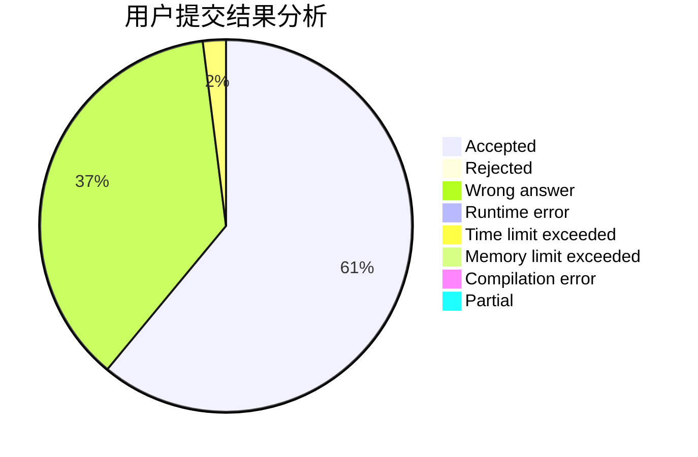
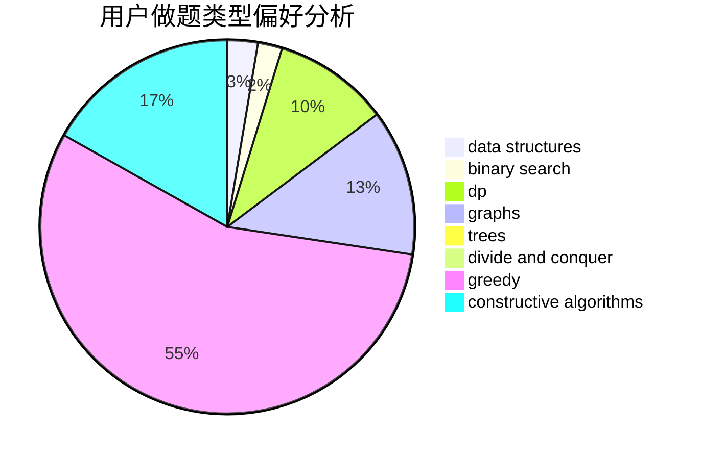
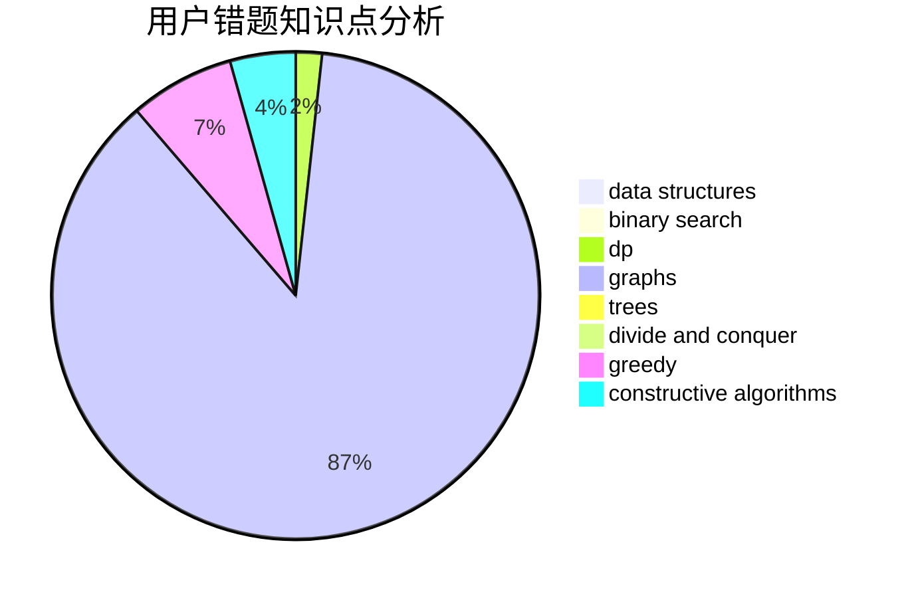

# rui_er

<!-- tabs:start -->

#### **用户提交结果分析**

#### **用户做题类型偏好分析**

#### **用户错题知识点分析**

<!-- tabs:end -->
# 推荐题目
[22B](https://codeforces.com/contest/22/problem/B)		brute force,
                        dp		  
[1088C](https://codeforces.com/contest/1088/problem/C)		constructive algorithms,
                        greedy,
                        math		  
[675A](https://codeforces.com/contest/675/problem/A)		math		  
[879B](https://codeforces.com/contest/879/problem/B)		data structures,
                        implementation		  
[723D](https://codeforces.com/contest/723/problem/D)		dfs and similar,
                        dsu,
                        graphs,
                        greedy,
                        implementation		  
[1379E](https://codeforces.com/contest/1379/problem/E)		constructive algorithms,
                        divide and conquer,
                        dp,
                        math,
                        trees		  
[243C](https://codeforces.com/contest/243/problem/C)		dfs and similar,
                        implementation		  
[1214E](https://codeforces.com/contest/1214/problem/E)		constructive algorithms,
                        graphs,
                        math,
                        sortings,
                        trees		  
[605A](https://codeforces.com/contest/605/problem/A)		constructive algorithms,
                        greedy		  
[1174E](https://codeforces.com/contest/1174/problem/E)		combinatorics,
                        dp,
                        math,
                        number theory		  
