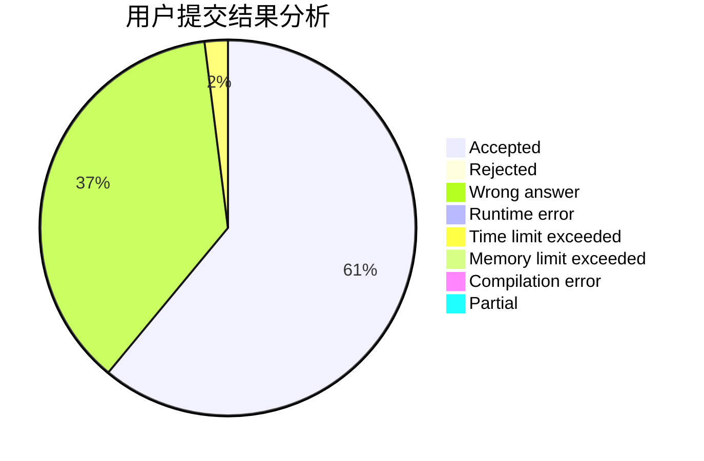
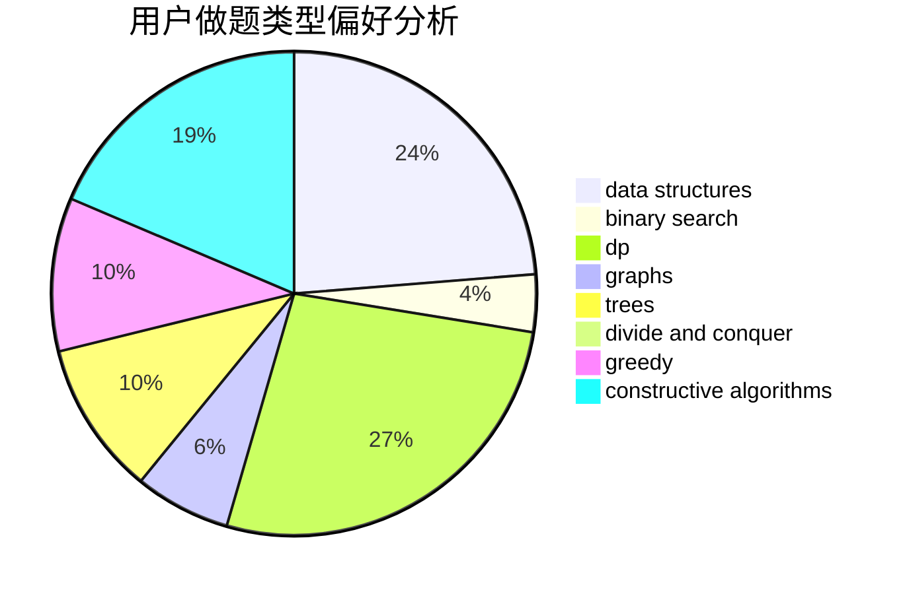

# rui_er

<!-- tabs:start -->

#### **用户提交结果分析**

#### **用户做题类型偏好分析**

#### **用户错题知识点分析**

<!-- tabs:end -->
# 推荐题目
[24E](https://codeforces.com/contest/24/problem/E)		binary search		  
[1088F](https://codeforces.com/contest/1088/problem/F)		data structures,
                        trees		  
[69A](https://codeforces.com/contest/69/problem/A)		implementation,
                        math		  
[899F](https://codeforces.com/contest/899/problem/F)		data structures,
                        strings		  
[741A](https://codeforces.com/contest/741/problem/A)		dfs and similar,
                        math		  
[1388E](https://codeforces.com/contest/1388/problem/E)		data structures,
                        geometry,
                        sortings		  
[264D](https://codeforces.com/contest/264/problem/D)		dp,
                        two pointers		  
[1220A](https://codeforces.com/contest/1220/problem/A)		implementation,
                        sortings,
                        strings		  
[623A](https://codeforces.com/contest/623/problem/A)		constructive algorithms,
                        graphs		  
[11781](https://codeforces.com/contest/1178/problem/1)		dsu,graphs,sortings,trees		  
