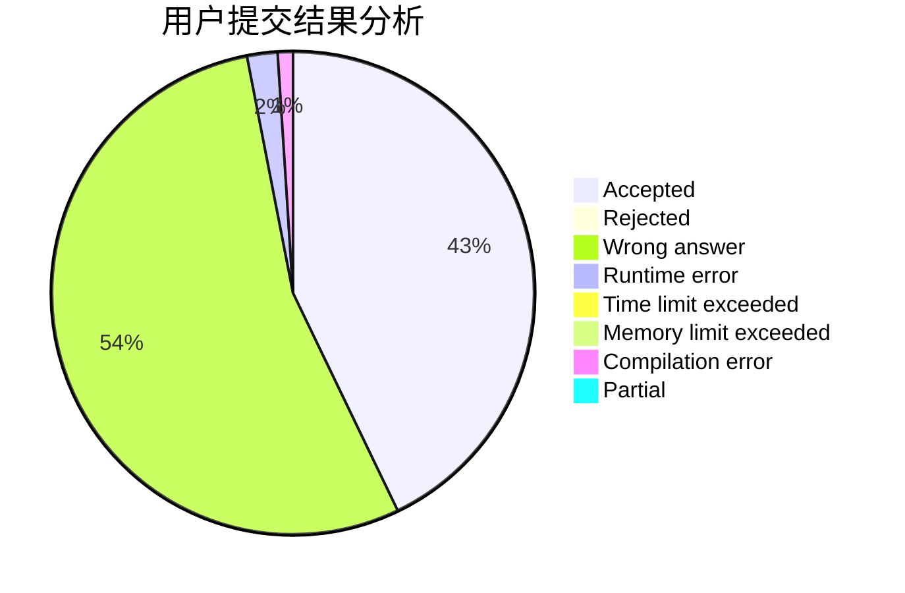
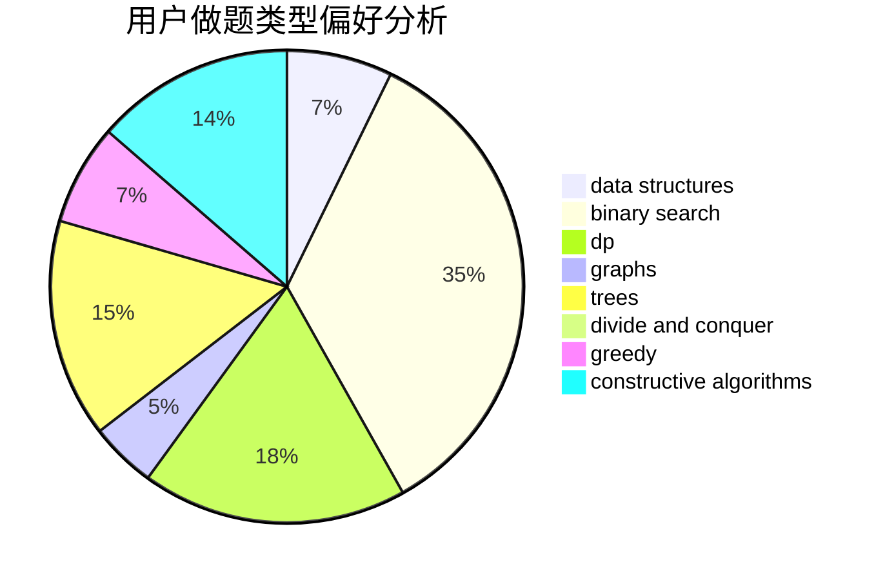
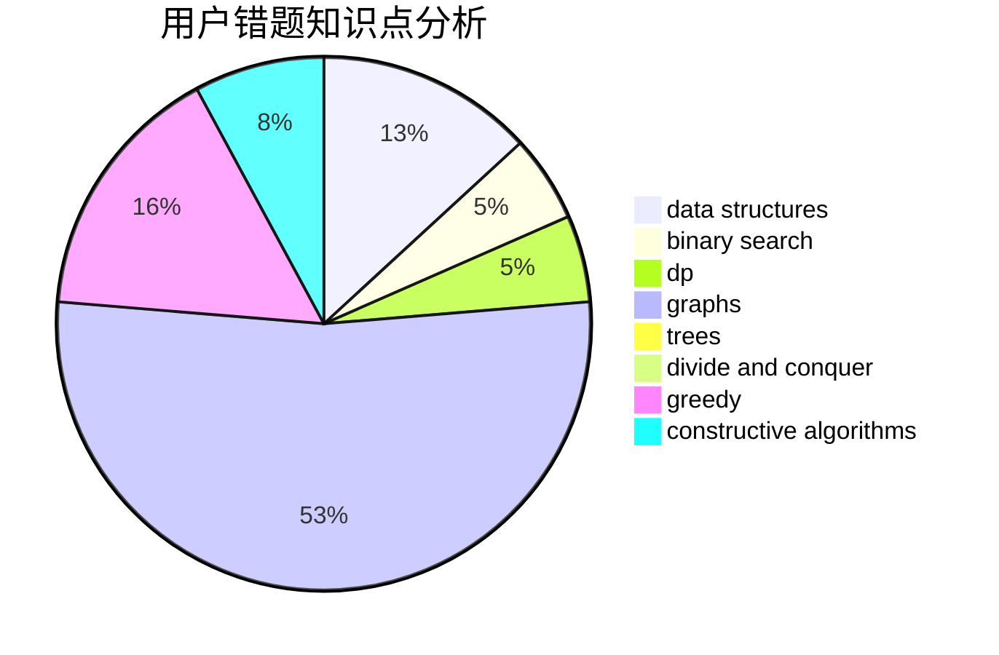

# rushcheyo

<!-- tabs:start -->

#### **用户提交结果分析**

#### **用户做题类型偏好分析**

#### **用户错题知识点分析**

<!-- tabs:end -->
# 推荐题目
[312A](https://codeforces.com/contest/312/problem/A)		implementation,
                        strings		  
[883C](https://codeforces.com/contest/883/problem/C)		binary search,
                        implementation		  
[808F](https://codeforces.com/contest/808/problem/F)		binary search,
                        flows,
                        graphs		  
[947D](https://codeforces.com/contest/947/problem/D)		dsu,graphs,sortings,trees		  
[611F](https://codeforces.com/contest/611/problem/F)		binary search,
                        implementation		  
[659A](https://codeforces.com/contest/659/problem/A)		implementation,
                        math		  
[474B](https://codeforces.com/contest/474/problem/B)		binary search,
                        implementation		  
[398C](https://codeforces.com/contest/398/problem/C)		constructive algorithms		  
[345A](https://codeforces.com/contest/345/problem/A)		*special problem,
                        probabilities		  
[1447E](https://codeforces.com/contest/1447/problem/E)		dsu,graphs,sortings,trees		  
