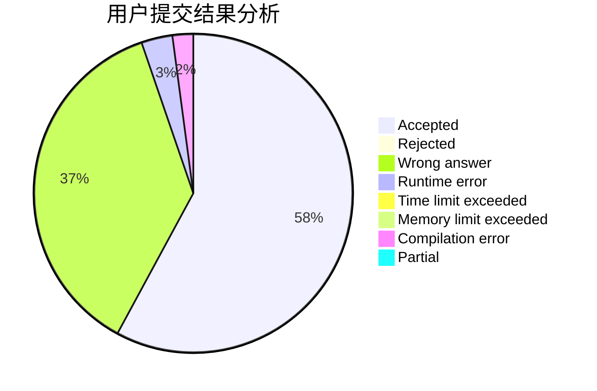
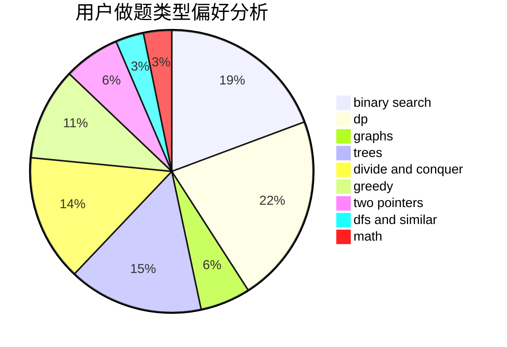

# CCSU_Cola

<!-- tabs:start -->

#### **用户提交结果分析**

#### **用户做题类型偏好分析**

<!-- tabs:end -->
# 推荐题目
[1161E](https://codeforces.com/contest/1161/problem/E)
[243D](https://codeforces.com/contest/243/problem/D)
[244C](https://codeforces.com/contest/244/problem/C)
[1161B](https://codeforces.com/contest/1161/problem/B)
[164C](https://codeforces.com/contest/164/problem/C)
[243C](https://codeforces.com/contest/243/problem/C)
[1132C](https://codeforces.com/contest/1132/problem/C)
[609C](https://codeforces.com/contest/609/problem/C)
[11651](https://codeforces.com/contest/1165/problem/1)
[1215D](https://codeforces.com/contest/1215/problem/D)
