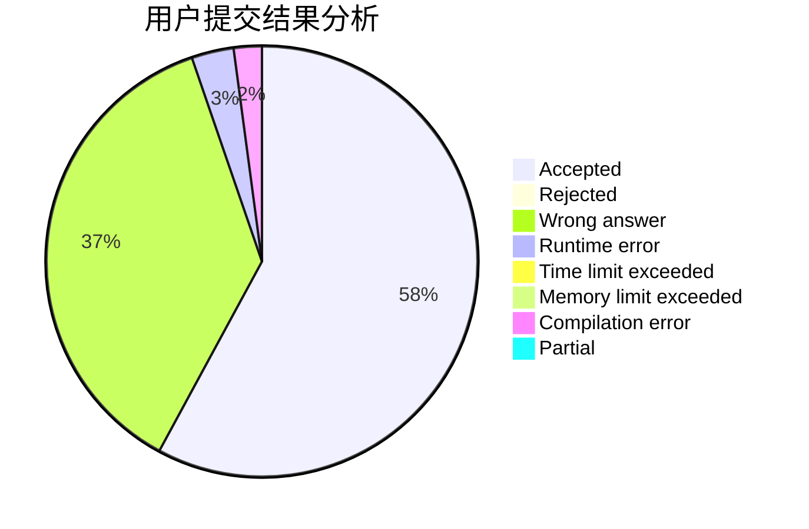
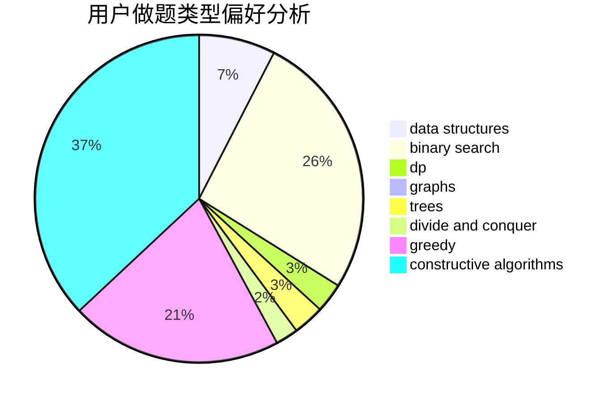
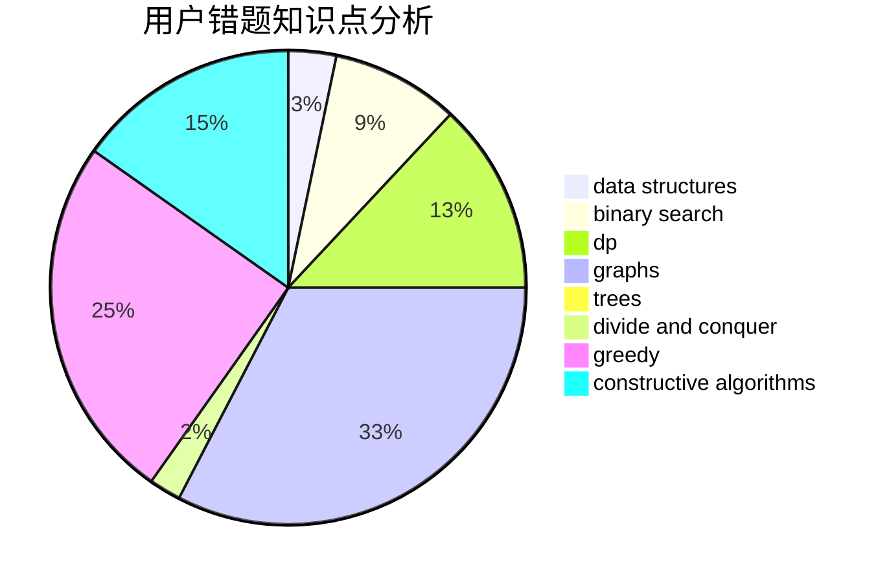

# CCSU_Cola

<!-- tabs:start -->

#### **用户提交结果分析**

#### **用户做题类型偏好分析**

#### **用户错题知识点分析**

<!-- tabs:end -->
# 推荐题目
[1159A](https://codeforces.com/contest/1159/problem/A)		implementation,
                        math		  
[225D](https://codeforces.com/contest/225/problem/D)		bitmasks,
                        dfs and similar,
                        graphs,
                        implementation		  
[225E](https://codeforces.com/contest/225/problem/E)		math,
                        number theory		  
[1158C](https://codeforces.com/contest/1158/problem/C)		constructive algorithms,
                        data structures,
                        dfs and similar,
                        graphs,
                        greedy,
                        math,
                        sortings		  
[1510D](https://codeforces.com/contest/1510/problem/D)		dp,
                        math,
                        number theory		  
[225C](https://codeforces.com/contest/225/problem/C)		dp,
                        matrices		  
[1130C](https://codeforces.com/contest/1130/problem/C)		brute force,
                        dfs and similar,
                        dsu		  
[58B](https://codeforces.com/contest/58/problem/B)		greedy		  
[1163C2](https://codeforces.com/contest/1163C/problem/2)		data structures,
                        geometry,
                        implementation,
                        math		  
[1209G1](https://codeforces.com/contest/1209G/problem/1)		data structures,
                        dsu,
                        greedy,
                        implementation,
                        two pointers		  
