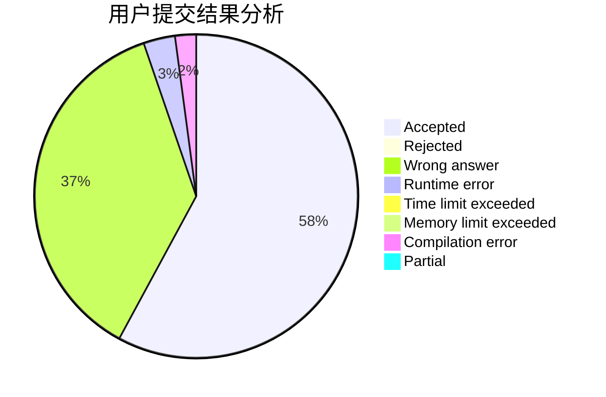
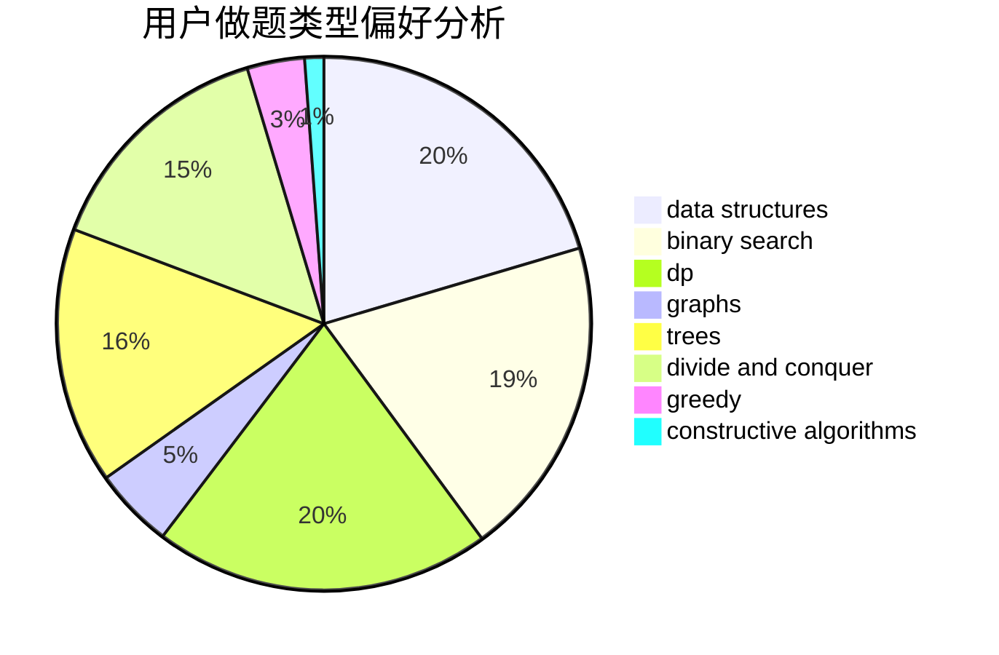
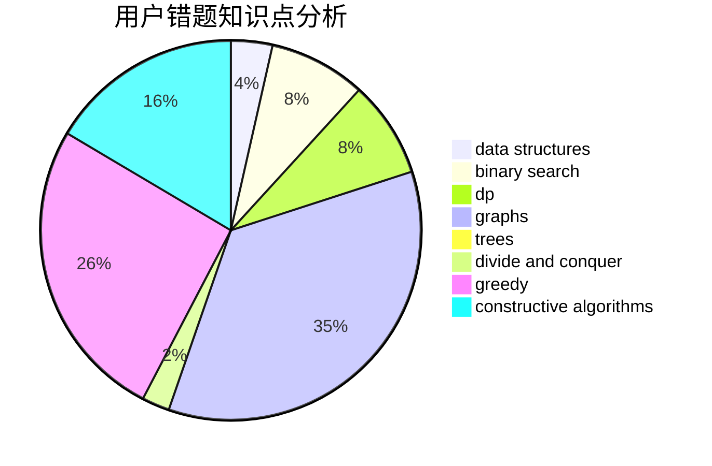

# CCSU_Cola

<!-- tabs:start -->

#### **用户提交结果分析**

#### **用户做题类型偏好分析**

#### **用户错题知识点分析**

<!-- tabs:end -->
# 推荐题目
[1161E](https://codeforces.com/contest/1161/problem/E)		dsu,graphs,sortings,trees		  
[243D](https://codeforces.com/contest/243/problem/D)		data structures,
                        dp,
                        geometry,
                        two pointers		  
[244C](https://codeforces.com/contest/244/problem/C)		dsu,graphs,sortings,trees		  
[1161B](https://codeforces.com/contest/1161/problem/B)		dsu,graphs,sortings,trees		  
[164C](https://codeforces.com/contest/164/problem/C)		flows,
                        graphs		  
[243C](https://codeforces.com/contest/243/problem/C)		dfs and similar,
                        implementation		  
[1132C](https://codeforces.com/contest/1132/problem/C)		brute force		  
[609C](https://codeforces.com/contest/609/problem/C)		implementation,
                        math		  
[11651](https://codeforces.com/contest/1165/problem/1)		dsu,graphs,sortings,trees		  
[1215D](https://codeforces.com/contest/1215/problem/D)		games,
                        greedy,
                        math		  
