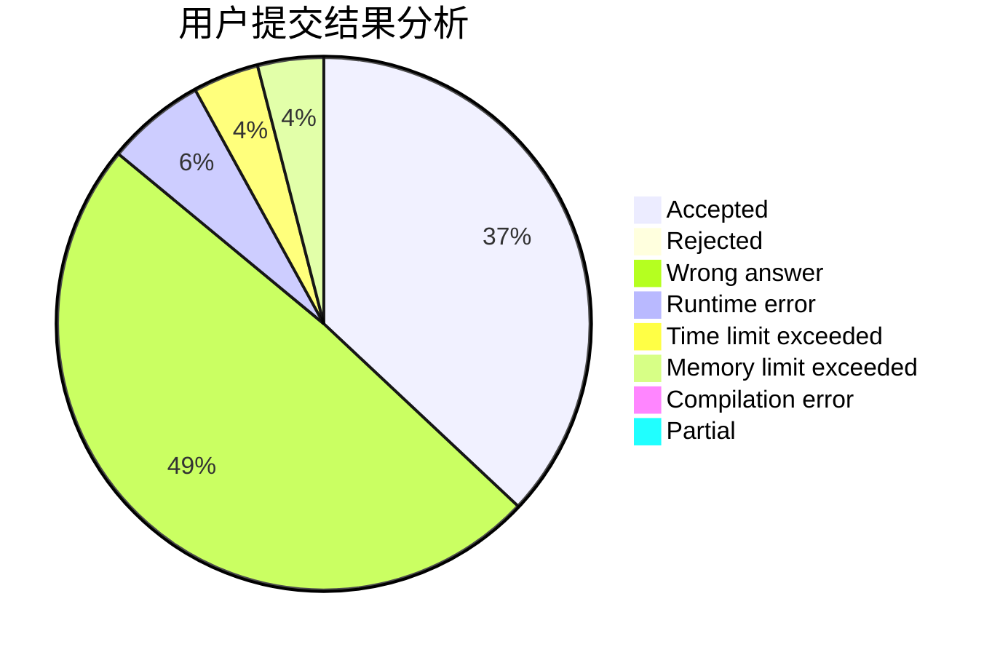
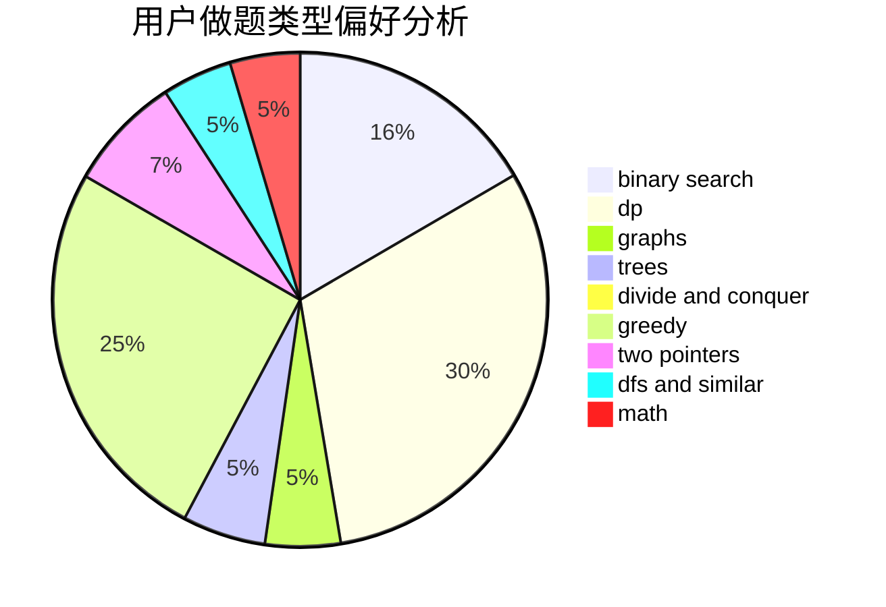

# ryzjyz

<!-- tabs:start -->

#### **用户提交结果分析**

#### **用户做题类型偏好分析**

<!-- tabs:end -->
# 推荐题目
[1313D](https://codeforces.com/contest/1313/problem/D)
[74A](https://codeforces.com/contest/74/problem/A)
[540A](https://codeforces.com/contest/540/problem/A)
[574A](https://codeforces.com/contest/574/problem/A)
[911C](https://codeforces.com/contest/911/problem/C)
[496B](https://codeforces.com/contest/496/problem/B)
[1278D](https://codeforces.com/contest/1278/problem/D)
[193D](https://codeforces.com/contest/193/problem/D)
[858A](https://codeforces.com/contest/858/problem/A)
[1079C](https://codeforces.com/contest/1079/problem/C)
