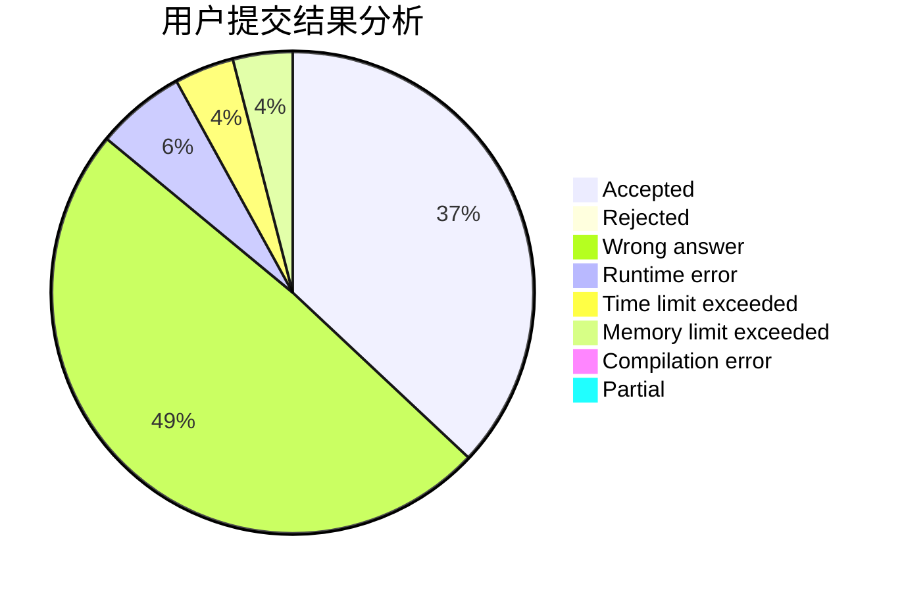
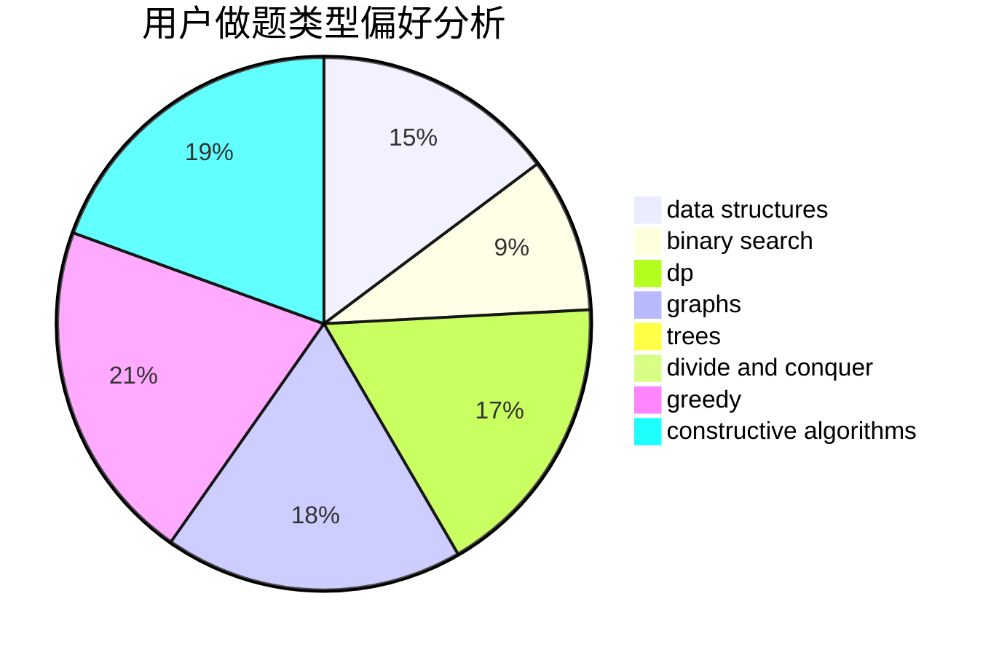
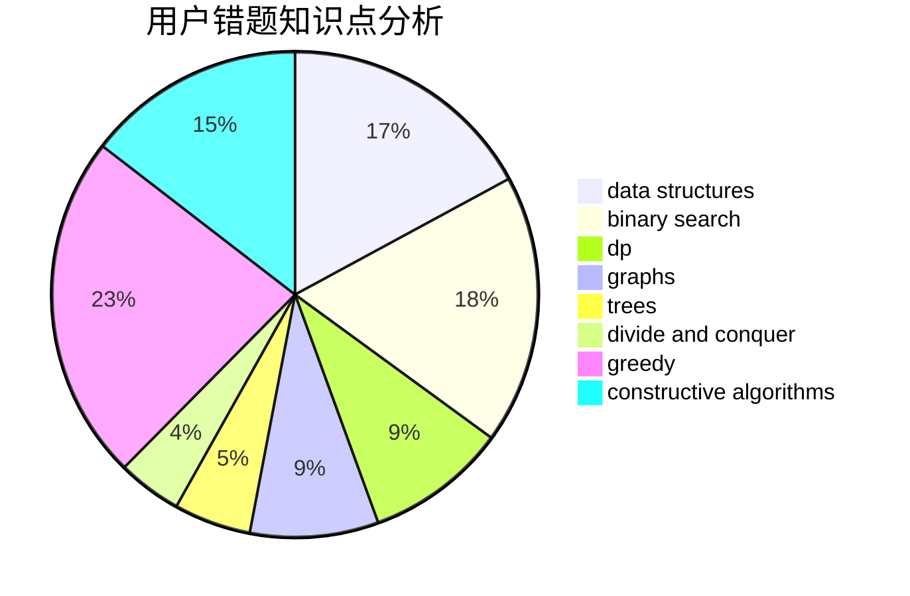

# ryzjyz

<!-- tabs:start -->

#### **用户提交结果分析**

#### **用户做题类型偏好分析**

#### **用户错题知识点分析**

<!-- tabs:end -->
# 推荐题目
[1304F2](https://codeforces.com/contest/1304F/problem/2)		data structures,
                        dp,
                        greedy		  
[731E](https://codeforces.com/contest/731/problem/E)		dp,
                        games		  
[514C](https://codeforces.com/contest/514/problem/C)		binary search,
                        data structures,
                        hashing,
                        string suffix structures,
                        strings		  
[549B](https://codeforces.com/contest/549/problem/B)		constructive algorithms,
                        dfs and similar,
                        graphs,
                        greedy		  
[893C](https://codeforces.com/contest/893/problem/C)		dfs and similar,
                        graphs,
                        greedy		  
[476D](https://codeforces.com/contest/476/problem/D)		constructive algorithms,
                        greedy,
                        math		  
[1269D](https://codeforces.com/contest/1269/problem/D)		dsu,graphs,sortings,trees		  
[167C](https://codeforces.com/contest/167/problem/C)		games,
                        math		  
[839A](https://codeforces.com/contest/839/problem/A)		implementation		  
[1078E](https://codeforces.com/contest/1078/problem/E)		constructive algorithms		  
