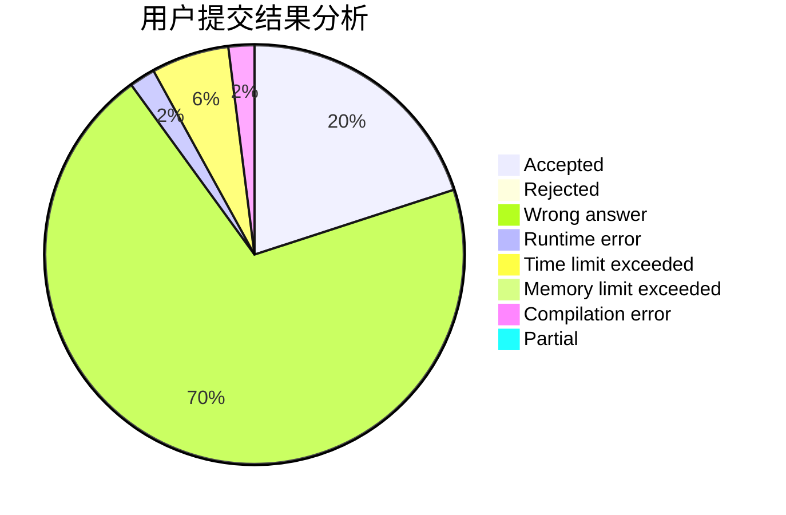
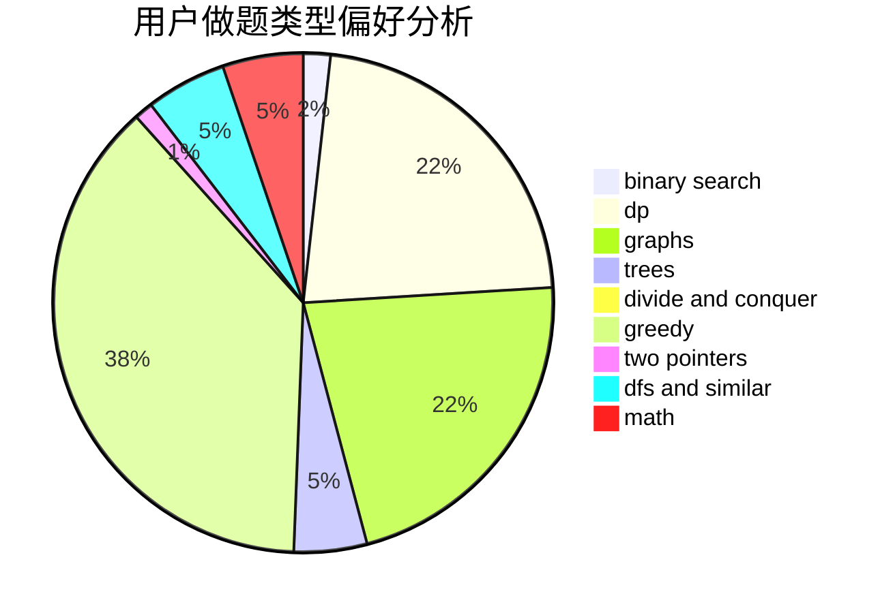

# s4kuy4

<!-- tabs:start -->

#### **用户提交结果分析**

#### **用户做题类型偏好分析**

<!-- tabs:end -->
# 推荐题目
[782A](https://codeforces.com/contest/782/problem/A)
[1408H](https://codeforces.com/contest/1408/problem/H)
[759B](https://codeforces.com/contest/759/problem/B)
[1147A](https://codeforces.com/contest/1147/problem/A)
[180C](https://codeforces.com/contest/180/problem/C)
[295C](https://codeforces.com/contest/295/problem/C)
[101D](https://codeforces.com/contest/101/problem/D)
[1000G](https://codeforces.com/contest/1000/problem/G)
[1455G](https://codeforces.com/contest/1455/problem/G)
[1041C](https://codeforces.com/contest/1041/problem/C)
