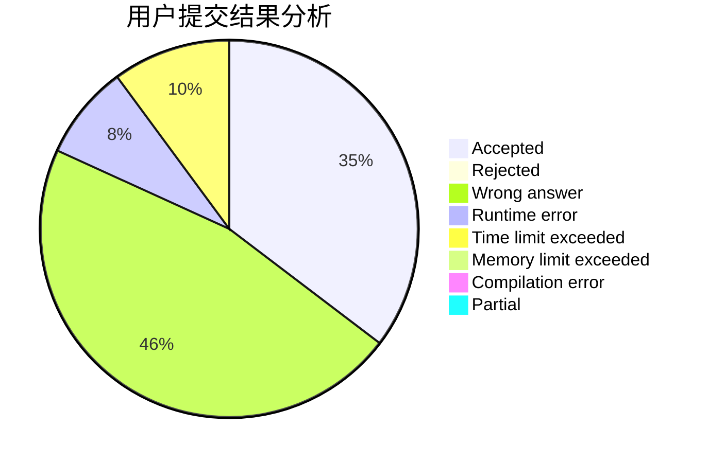
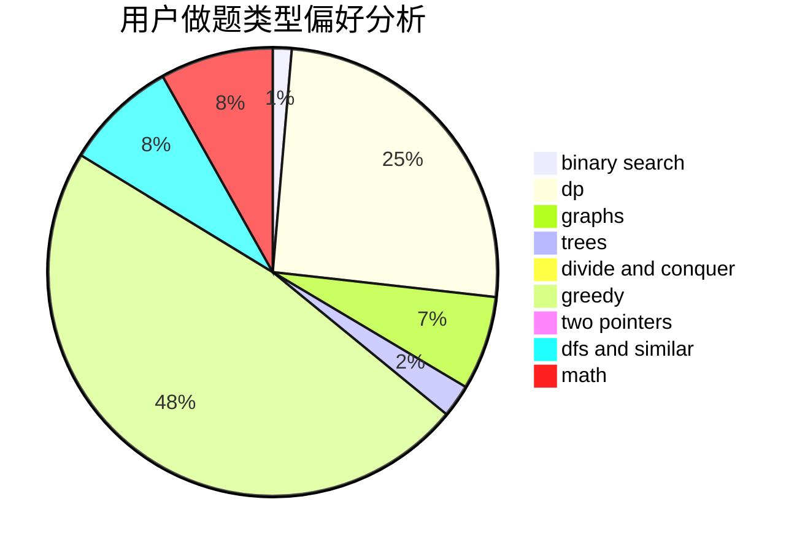

# s_r_f

<!-- tabs:start -->

#### **用户提交结果分析**

#### **用户做题类型偏好分析**

<!-- tabs:end -->
# 推荐题目
[1028D](https://codeforces.com/contest/1028/problem/D)
[215C](https://codeforces.com/contest/215/problem/C)
[631D](https://codeforces.com/contest/631/problem/D)
[1182A](https://codeforces.com/contest/1182/problem/A)
[405A](https://codeforces.com/contest/405/problem/A)
[1337B](https://codeforces.com/contest/1337/problem/B)
[436A](https://codeforces.com/contest/436/problem/A)
[282B](https://codeforces.com/contest/282/problem/B)
[1320B](https://codeforces.com/contest/1320/problem/B)
[1271F](https://codeforces.com/contest/1271/problem/F)
