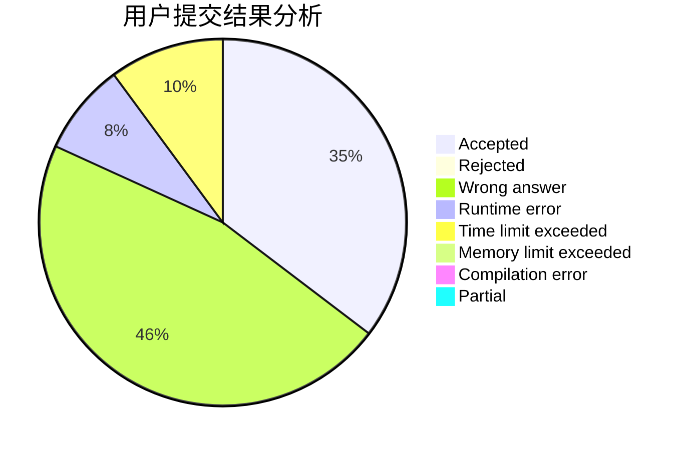
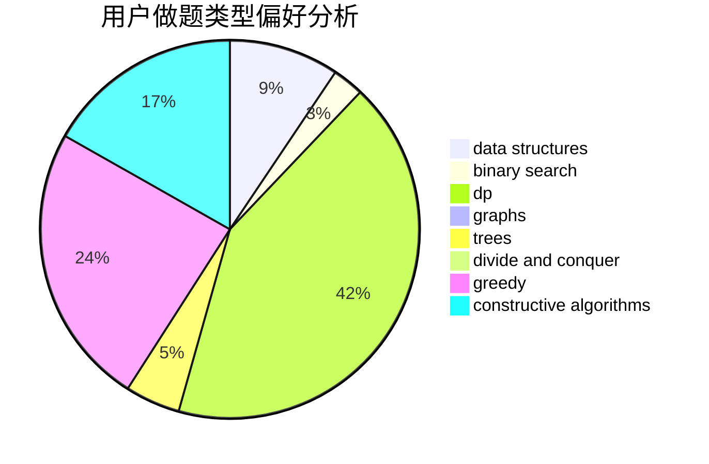
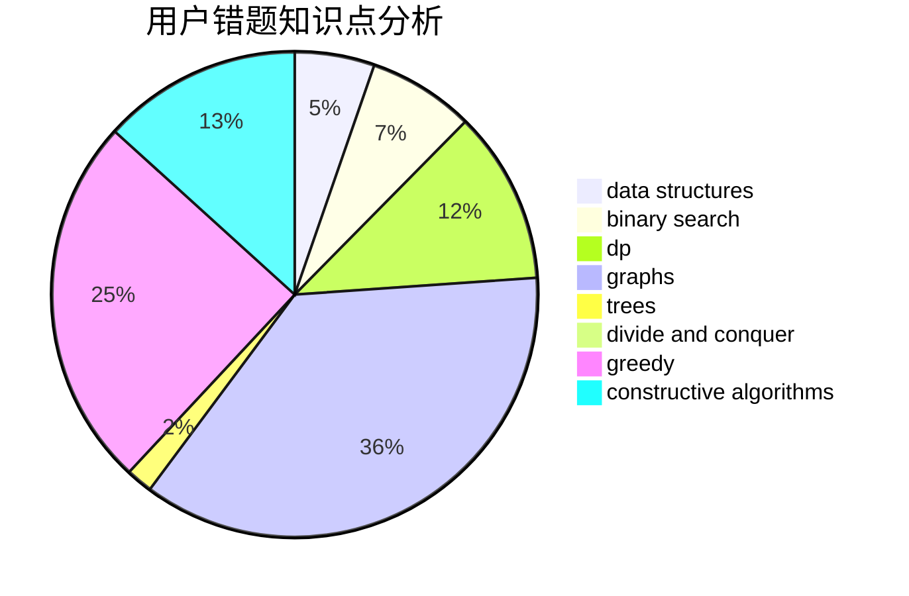

# s_r_f

<!-- tabs:start -->

#### **用户提交结果分析**

#### **用户做题类型偏好分析**

#### **用户错题知识点分析**

<!-- tabs:end -->
# 推荐题目
[1028D](https://codeforces.com/contest/1028/problem/D)		combinatorics,
                        data structures,
                        greedy		  
[215C](https://codeforces.com/contest/215/problem/C)		brute force,
                        implementation		  
[631D](https://codeforces.com/contest/631/problem/D)		data structures,
                        hashing,
                        implementation,
                        string suffix structures,
                        strings		  
[1182A](https://codeforces.com/contest/1182/problem/A)		dp,
                        math		  
[405A](https://codeforces.com/contest/405/problem/A)		greedy,
                        implementation,
                        sortings		  
[1337B](https://codeforces.com/contest/1337/problem/B)		greedy,
                        implementation,
                        math		  
[436A](https://codeforces.com/contest/436/problem/A)		greedy		  
[282B](https://codeforces.com/contest/282/problem/B)		greedy,
                        math		  
[1320B](https://codeforces.com/contest/1320/problem/B)		dfs and similar,
                        graphs,
                        shortest paths		  
[1271F](https://codeforces.com/contest/1271/problem/F)		brute force		  
