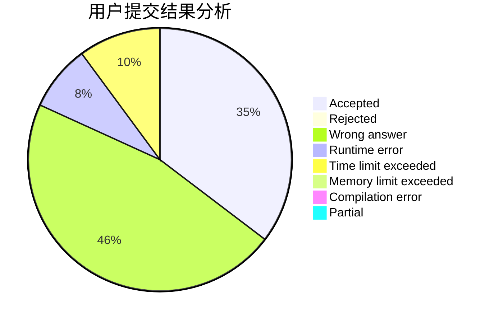
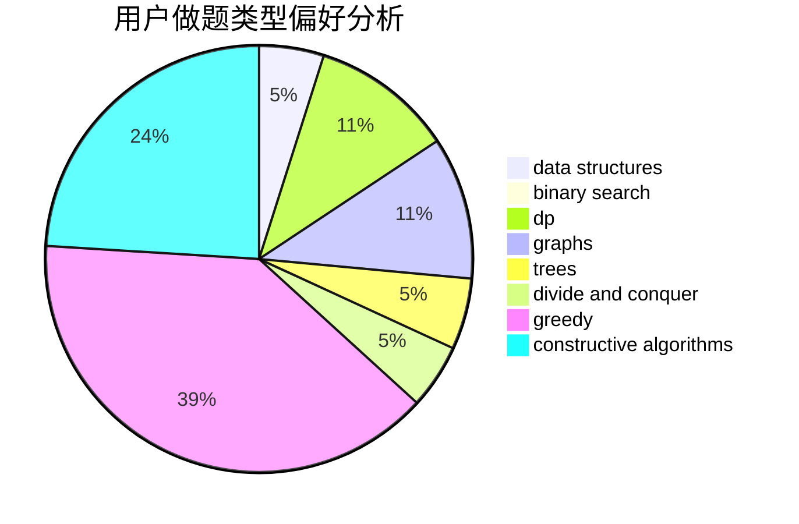
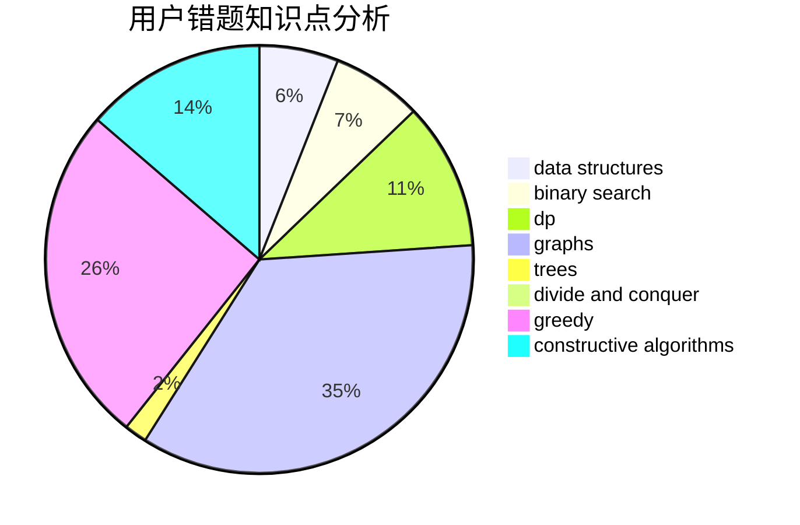

# s_r_f

<!-- tabs:start -->

#### **用户提交结果分析**

#### **用户做题类型偏好分析**

#### **用户错题知识点分析**

<!-- tabs:end -->
# 推荐题目
[1028A](https://codeforces.com/contest/1028/problem/A)		implementation		  
[18E](https://codeforces.com/contest/18/problem/E)		dp		  
[612B](https://codeforces.com/contest/612/problem/B)		implementation,
                        math		  
[1179B](https://codeforces.com/contest/1179/problem/B)		constructive algorithms		  
[376B](https://codeforces.com/contest/376/problem/B)		implementation		  
[1331C](https://codeforces.com/contest/1331/problem/C)		bitmasks		  
[407B](https://codeforces.com/contest/407/problem/B)		dp,
                        implementation		  
[266C](https://codeforces.com/contest/266/problem/C)		constructive algorithms,
                        greedy,
                        math		  
[1311A](https://codeforces.com/contest/1311/problem/A)		greedy,
                        implementation,
                        math		  
[1266E](https://codeforces.com/contest/1266/problem/E)		data structures,
                        greedy,
                        implementation		  
