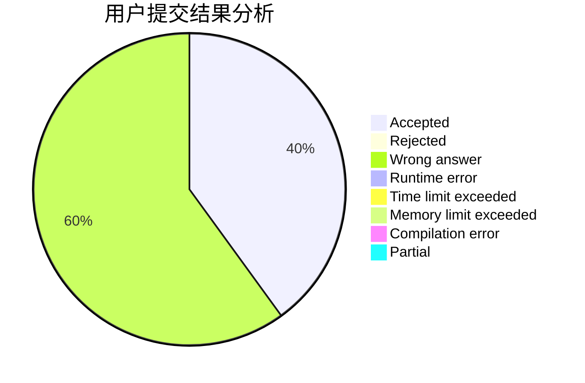
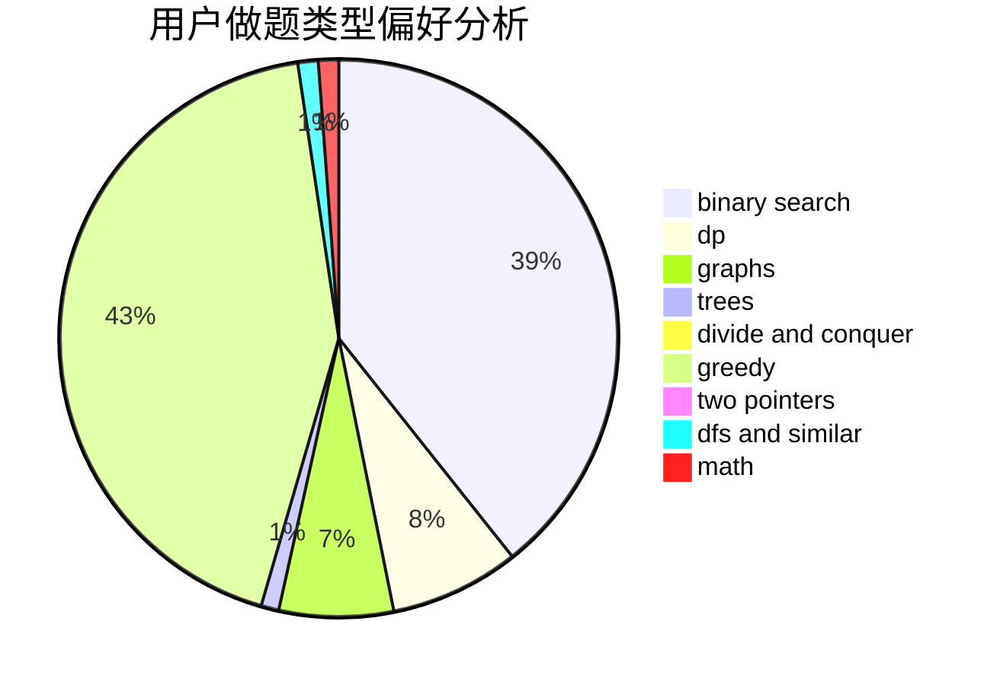

# s_zecher

<!-- tabs:start -->

#### **用户提交结果分析**

#### **用户做题类型偏好分析**

<!-- tabs:end -->
# 推荐题目
[1472A](https://codeforces.com/contest/1472/problem/A)
[1490F](https://codeforces.com/contest/1490/problem/F)
[581C](https://codeforces.com/contest/581/problem/C)
[699A](https://codeforces.com/contest/699/problem/A)
[198E](https://codeforces.com/contest/198/problem/E)
[216B](https://codeforces.com/contest/216/problem/B)
[61A](https://codeforces.com/contest/61/problem/A)
[335F](https://codeforces.com/contest/335/problem/F)
[717H](https://codeforces.com/contest/717/problem/H)
[1078E](https://codeforces.com/contest/1078/problem/E)
