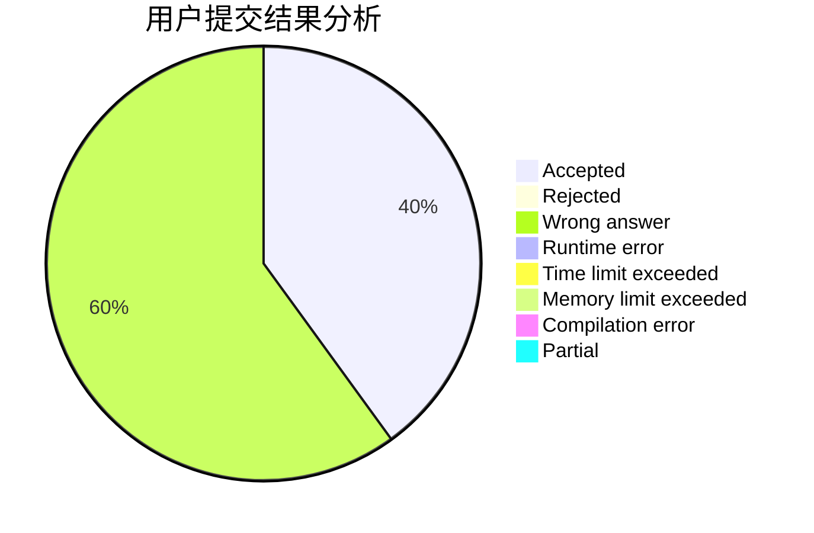
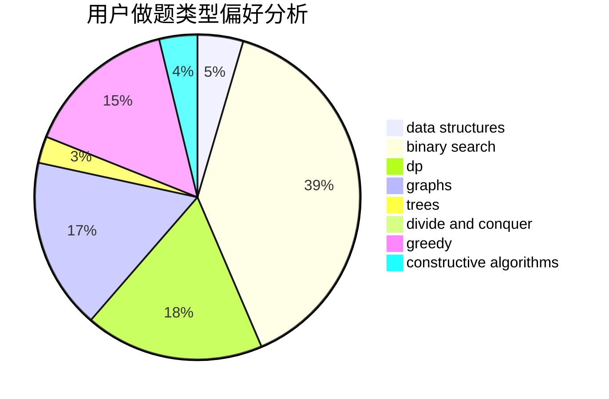

# s_zecher

<!-- tabs:start -->

#### **用户提交结果分析**

#### **用户做题类型偏好分析**

#### **用户错题知识点分析**

<!-- tabs:end -->
# 推荐题目
[1472A](https://codeforces.com/contest/1472/problem/A)		greedy,
                        math		  
[1490F](https://codeforces.com/contest/1490/problem/F)		binary search,
                        data structures,
                        greedy,
                        math,
                        sortings		  
[581C](https://codeforces.com/contest/581/problem/C)		implementation,
                        math,
                        sortings		  
[699A](https://codeforces.com/contest/699/problem/A)		implementation		  
[198E](https://codeforces.com/contest/198/problem/E)		binary search,
                        data structures,
                        sortings		  
[216B](https://codeforces.com/contest/216/problem/B)		dfs and similar,
                        implementation		  
[61A](https://codeforces.com/contest/61/problem/A)		implementation		  
[335F](https://codeforces.com/contest/335/problem/F)		dp,
                        greedy		  
[717H](https://codeforces.com/contest/717/problem/H)		math,
                        probabilities		  
[1078E](https://codeforces.com/contest/1078/problem/E)		constructive algorithms		  
