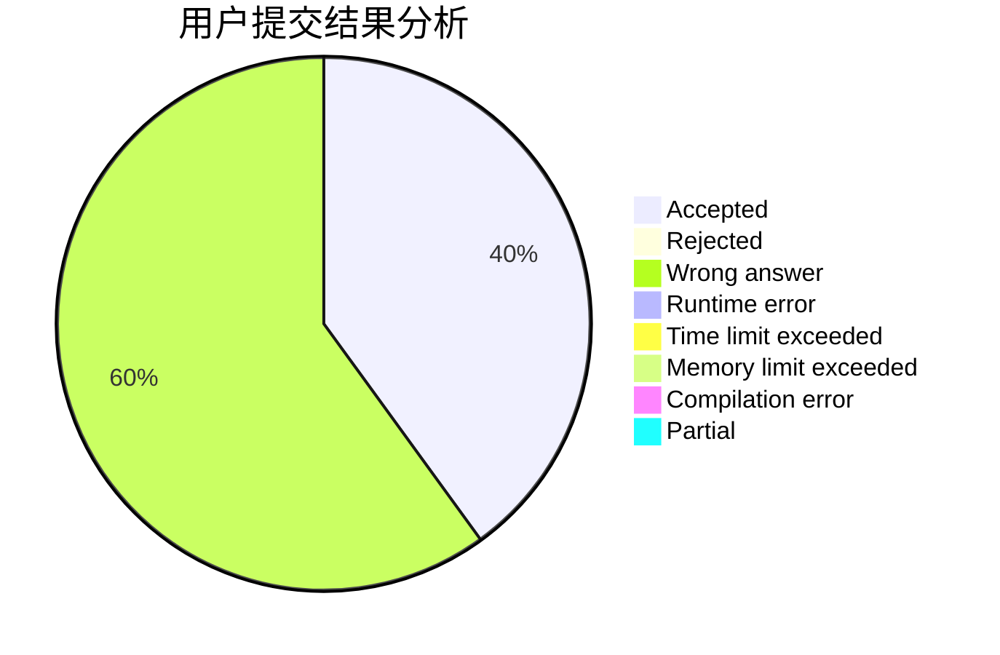
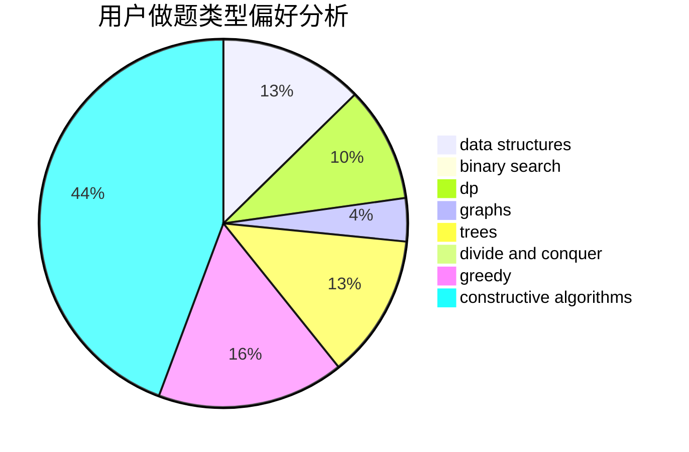

# s_zecher

<!-- tabs:start -->

#### **用户提交结果分析**

#### **用户做题类型偏好分析**

#### **用户错题知识点分析**

<!-- tabs:end -->
# 推荐题目
[1464F](https://codeforces.com/contest/1464/problem/F)		data structures,
                        trees		  
[1483A](https://codeforces.com/contest/1483/problem/A)		dsu,graphs,sortings,trees		  
[558E](https://codeforces.com/contest/558/problem/E)		data structures,
                        sortings,
                        strings		  
[673B](https://codeforces.com/contest/673/problem/B)		greedy,
                        implementation		  
[171D](https://codeforces.com/contest/171/problem/D)		*special problem,
                        brute force		  
[193A](https://codeforces.com/contest/193/problem/A)		constructive algorithms,
                        graphs,
                        trees		  
[600B](https://codeforces.com/contest/600/problem/B)		binary search,
                        data structures,
                        sortings,
                        two pointers		  
[312A](https://codeforces.com/contest/312/problem/A)		implementation,
                        strings		  
[6D](https://codeforces.com/contest/6/problem/D)		brute force,
                        dp		  
[1078B](https://codeforces.com/contest/1078/problem/B)		dsu,graphs,sortings,trees		  
