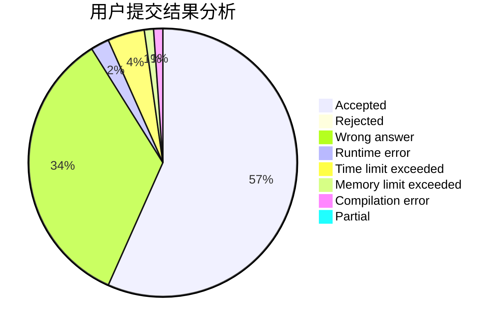
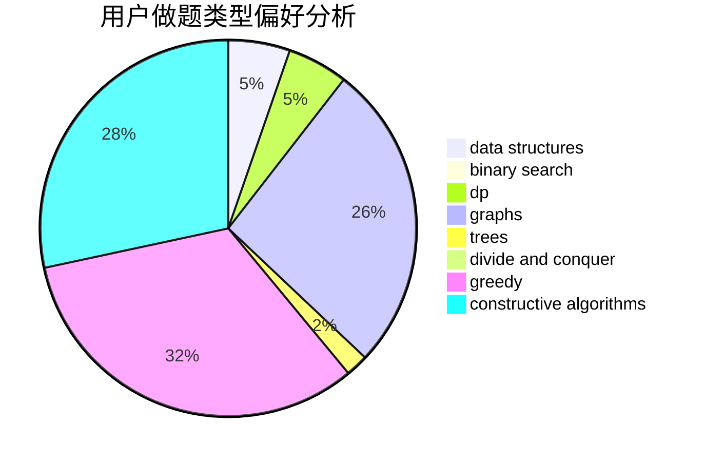

# sagittarius_fjz

<!-- tabs:start -->

#### **用户提交结果分析**

#### **用户做题类型偏好分析**

#### **用户错题知识点分析**

<!-- tabs:end -->
# 推荐题目
[773D](https://codeforces.com/contest/773/problem/D)		dp,
                        graphs,
                        shortest paths		  
[730J](https://codeforces.com/contest/730/problem/J)		dp		  
[508A](https://codeforces.com/contest/508/problem/A)		brute force		  
[1005A](https://codeforces.com/contest/1005/problem/A)		implementation		  
[466A](https://codeforces.com/contest/466/problem/A)		implementation		  
[939E](https://codeforces.com/contest/939/problem/E)		binary search,
                        greedy,
                        ternary search,
                        two pointers		  
[702A](https://codeforces.com/contest/702/problem/A)		dp,
                        greedy,
                        implementation		  
[484B](https://codeforces.com/contest/484/problem/B)		binary search,
                        math,
                        sortings,
                        two pointers		  
[1101F](https://codeforces.com/contest/1101/problem/F)		binary search,
                        dp		  
[1162C](https://codeforces.com/contest/1162/problem/C)		dsu,graphs,sortings,trees		  
