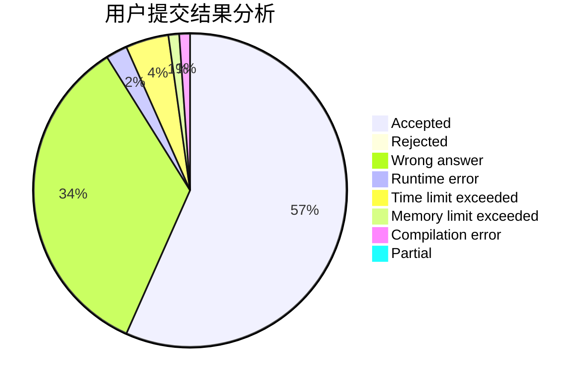
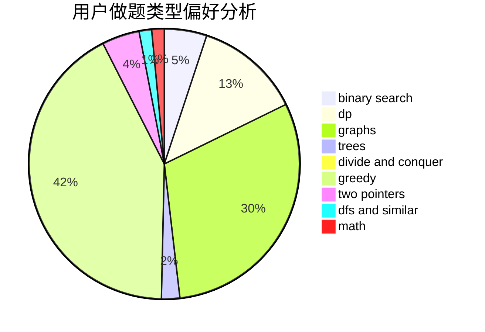

# sagittarius_fjz

<!-- tabs:start -->

#### **用户提交结果分析**

#### **用户做题类型偏好分析**

<!-- tabs:end -->
# 推荐题目
[773D](https://codeforces.com/contest/773/problem/D)
[730J](https://codeforces.com/contest/730/problem/J)
[508A](https://codeforces.com/contest/508/problem/A)
[1005A](https://codeforces.com/contest/1005/problem/A)
[466A](https://codeforces.com/contest/466/problem/A)
[939E](https://codeforces.com/contest/939/problem/E)
[702A](https://codeforces.com/contest/702/problem/A)
[484B](https://codeforces.com/contest/484/problem/B)
[1101F](https://codeforces.com/contest/1101/problem/F)
[1162C](https://codeforces.com/contest/1162/problem/C)
