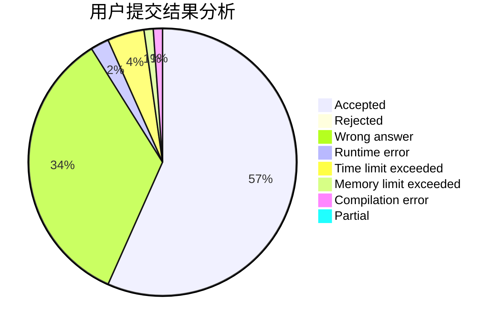
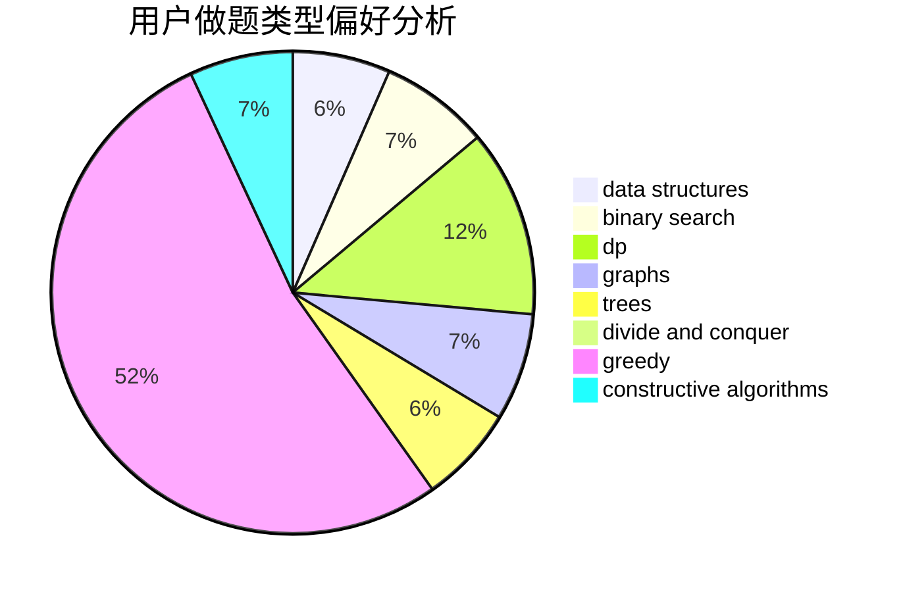

# sagittarius_fjz

<!-- tabs:start -->

#### **用户提交结果分析**

#### **用户做题类型偏好分析**

#### **用户错题知识点分析**

<!-- tabs:end -->
# 推荐题目
[754E](https://codeforces.com/contest/754/problem/E)		bitmasks,
                        brute force,
                        fft,
                        strings,
                        trees		  
[710F](https://codeforces.com/contest/710/problem/F)		brute force,
                        data structures,
                        hashing,
                        interactive,
                        string suffix structures,
                        strings		  
[487A](https://codeforces.com/contest/487/problem/A)		binary search,
                        brute force,
                        implementation		  
[1004F](https://codeforces.com/contest/1004/problem/F)		bitmasks,
                        data structures,
                        divide and conquer		  
[445C](https://codeforces.com/contest/445/problem/C)		dsu,graphs,sortings,trees		  
[919D](https://codeforces.com/contest/919/problem/D)		dfs and similar,
                        dp,
                        graphs		  
[678C](https://codeforces.com/contest/678/problem/C)		implementation,
                        math,
                        number theory		  
[464C](https://codeforces.com/contest/464/problem/C)		dp		  
[1101C](https://codeforces.com/contest/1101/problem/C)		sortings		  
[1159D](https://codeforces.com/contest/1159/problem/D)		dsu,graphs,sortings,trees		  
