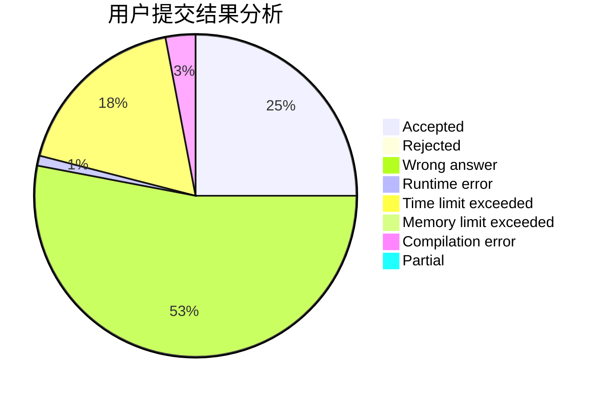
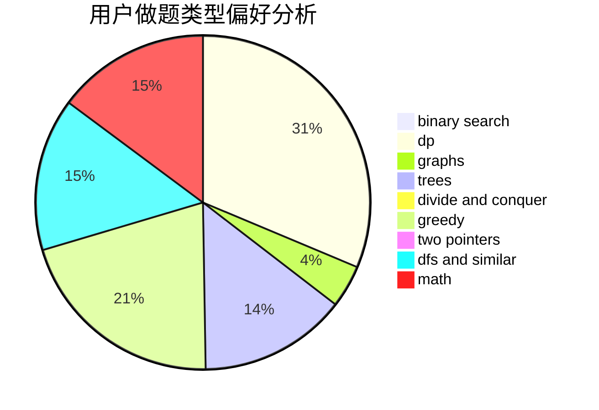

# sahdsg

<!-- tabs:start -->

#### **用户提交结果分析**

#### **用户做题类型偏好分析**

<!-- tabs:end -->
# 推荐题目
[1505C](https://codeforces.com/contest/1505/problem/C)
[784C](https://codeforces.com/contest/784/problem/C)
[567F](https://codeforces.com/contest/567/problem/F)
[398A](https://codeforces.com/contest/398/problem/A)
[1041A](https://codeforces.com/contest/1041/problem/A)
[1146D](https://codeforces.com/contest/1146/problem/D)
[1078B](https://codeforces.com/contest/1078/problem/B)
[917C](https://codeforces.com/contest/917/problem/C)
[848D](https://codeforces.com/contest/848/problem/D)
[1481E](https://codeforces.com/contest/1481/problem/E)
