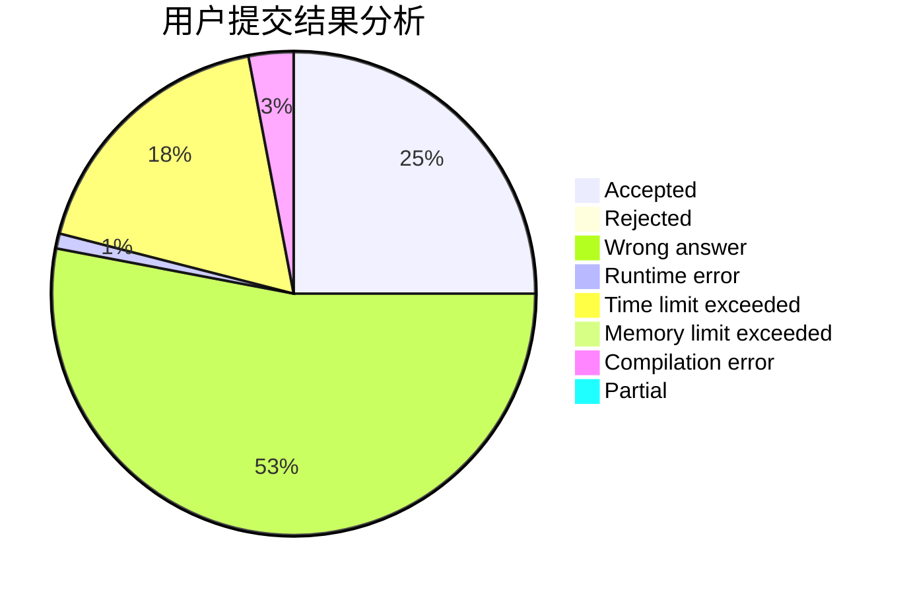
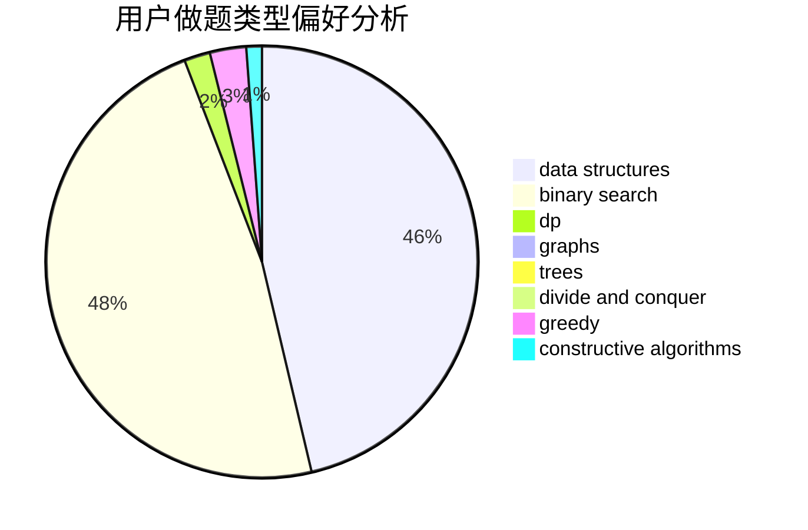
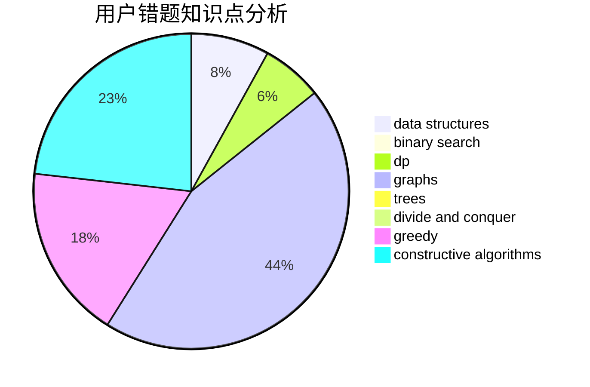

# sahdsg

<!-- tabs:start -->

#### **用户提交结果分析**

#### **用户做题类型偏好分析**

#### **用户错题知识点分析**

<!-- tabs:end -->
# 推荐题目
[1496C](https://codeforces.com/contest/1496/problem/C)		dsu,graphs,sortings,trees		  
[764E](https://codeforces.com/contest/764/problem/E)		dsu,graphs,sortings,trees		  
[543D](https://codeforces.com/contest/543/problem/D)		dp,
                        trees		  
[367B](https://codeforces.com/contest/367/problem/B)		binary search,
                        data structures		  
[1040A](https://codeforces.com/contest/1040/problem/A)		greedy		  
[1144C](https://codeforces.com/contest/1144/problem/C)		constructive algorithms,
                        sortings		  
[1077F1](https://codeforces.com/contest/1077F/problem/1)		dp		  
[900E](https://codeforces.com/contest/900/problem/E)		data structures,
                        dp,
                        strings		  
[830D](https://codeforces.com/contest/830/problem/D)		combinatorics,
                        dp,
                        graphs,
                        trees		  
[1473B](https://codeforces.com/contest/1473/problem/B)		brute force,
                        math,
                        number theory,
                        strings		  
