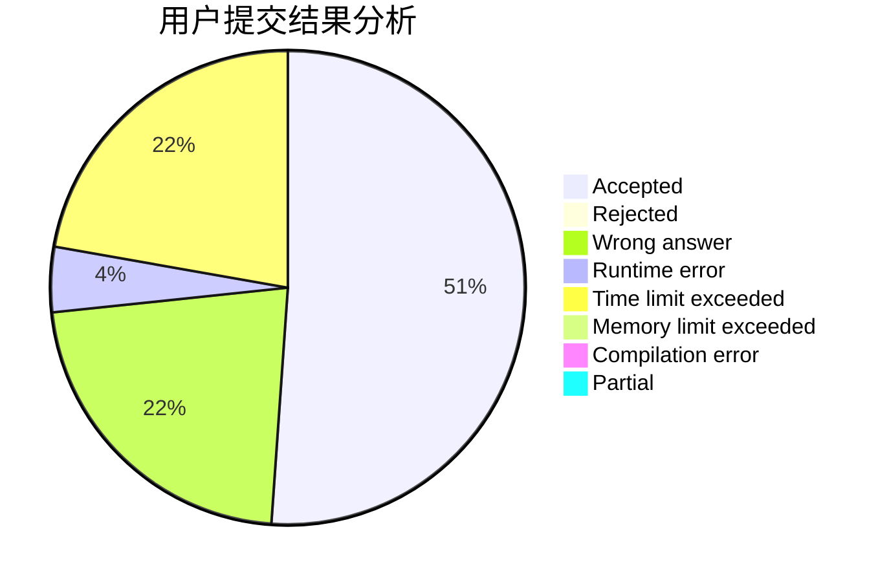
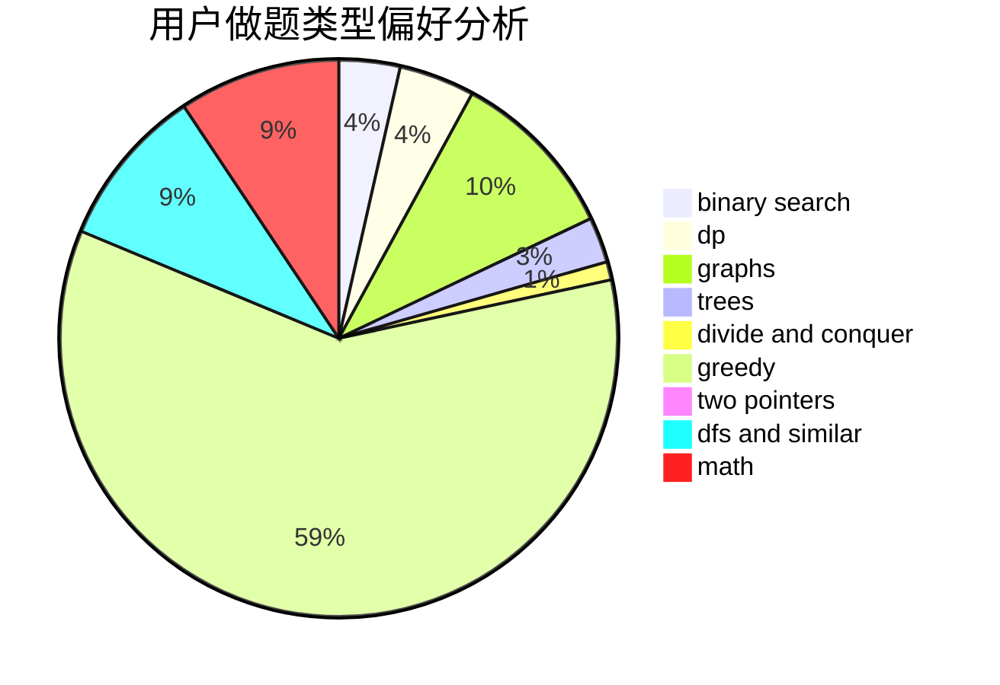

# sakura_yu

<!-- tabs:start -->

#### **用户提交结果分析**

#### **用户做题类型偏好分析**

<!-- tabs:end -->
# 推荐题目
[946G](https://codeforces.com/contest/946/problem/G)
[766E](https://codeforces.com/contest/766/problem/E)
[957E](https://codeforces.com/contest/957/problem/E)
[766D](https://codeforces.com/contest/766/problem/D)
[827A](https://codeforces.com/contest/827/problem/A)
[660E](https://codeforces.com/contest/660/problem/E)
[670B](https://codeforces.com/contest/670/problem/B)
[739D](https://codeforces.com/contest/739/problem/D)
[119D](https://codeforces.com/contest/119/problem/D)
[681C](https://codeforces.com/contest/681/problem/C)
