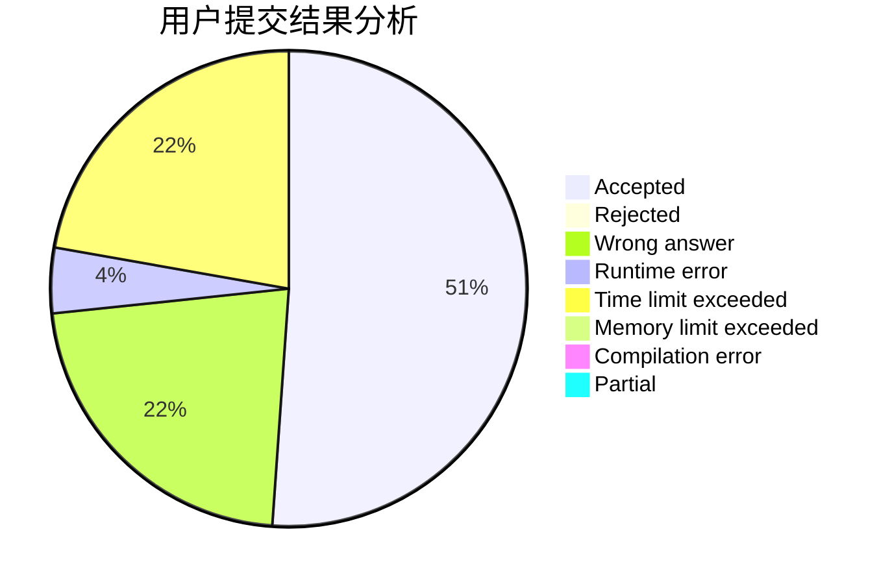
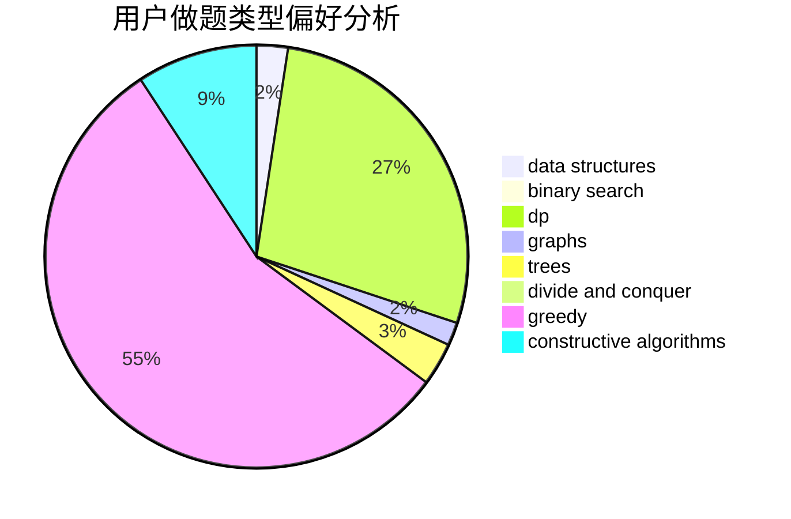

# sakura_yu

<!-- tabs:start -->

#### **用户提交结果分析**

#### **用户做题类型偏好分析**

#### **用户错题知识点分析**

<!-- tabs:end -->
# 推荐题目
[923B](https://codeforces.com/contest/923/problem/B)		binary search,
                        data structures		  
[747B](https://codeforces.com/contest/747/problem/B)		implementation,
                        strings		  
[935F](https://codeforces.com/contest/935/problem/F)		data structures,
                        greedy		  
[747A](https://codeforces.com/contest/747/problem/A)		brute force,
                        math		  
[809B](https://codeforces.com/contest/809/problem/B)		binary search,
                        interactive		  
[630J](https://codeforces.com/contest/630/problem/J)		math,
                        number theory		  
[643D](https://codeforces.com/contest/643/problem/D)		nan		  
[722C](https://codeforces.com/contest/722/problem/C)		data structures,
                        dsu		  
[1195E](https://codeforces.com/contest/1195/problem/E)		data structures,
                        two pointers		  
[660E](https://codeforces.com/contest/660/problem/E)		combinatorics		  
