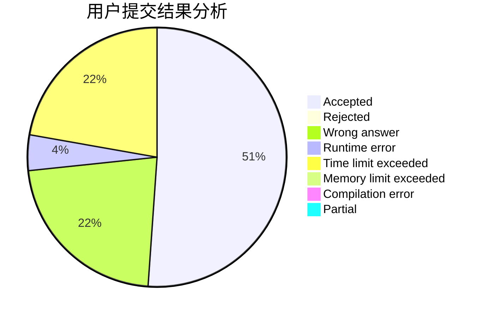
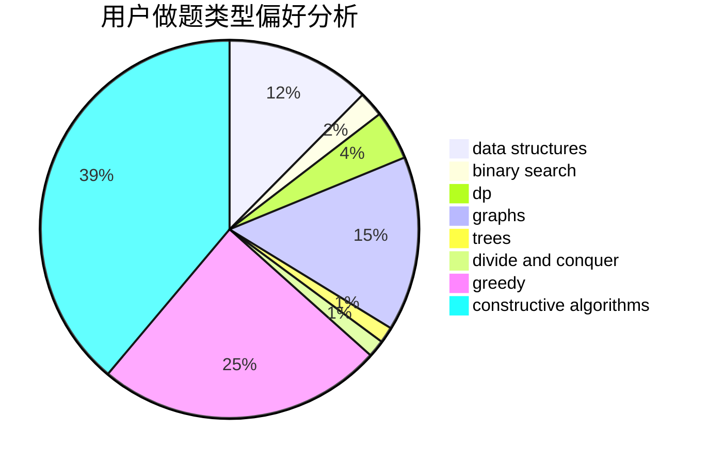

# sakura_yu

<!-- tabs:start -->

#### **用户提交结果分析**

#### **用户做题类型偏好分析**

#### **用户错题知识点分析**

<!-- tabs:end -->
# 推荐题目
[946G](https://codeforces.com/contest/946/problem/G)		data structures,
                        dp		  
[766E](https://codeforces.com/contest/766/problem/E)		bitmasks,
                        constructive algorithms,
                        data structures,
                        dfs and similar,
                        dp,
                        math,
                        trees		  
[957E](https://codeforces.com/contest/957/problem/E)		dsu,graphs,sortings,trees		  
[766D](https://codeforces.com/contest/766/problem/D)		data structures,
                        dfs and similar,
                        dp,
                        dsu,
                        graphs		  
[827A](https://codeforces.com/contest/827/problem/A)		data structures,
                        greedy,
                        sortings,
                        strings		  
[660E](https://codeforces.com/contest/660/problem/E)		combinatorics		  
[670B](https://codeforces.com/contest/670/problem/B)		implementation		  
[739D](https://codeforces.com/contest/739/problem/D)		graph matchings		  
[119D](https://codeforces.com/contest/119/problem/D)		hashing,
                        strings		  
[681C](https://codeforces.com/contest/681/problem/C)		constructive algorithms,
                        data structures,
                        greedy		  
