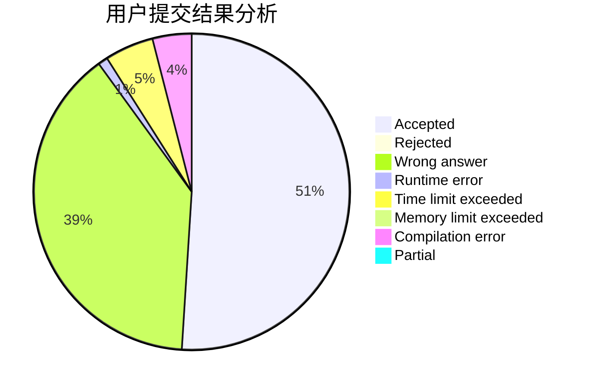
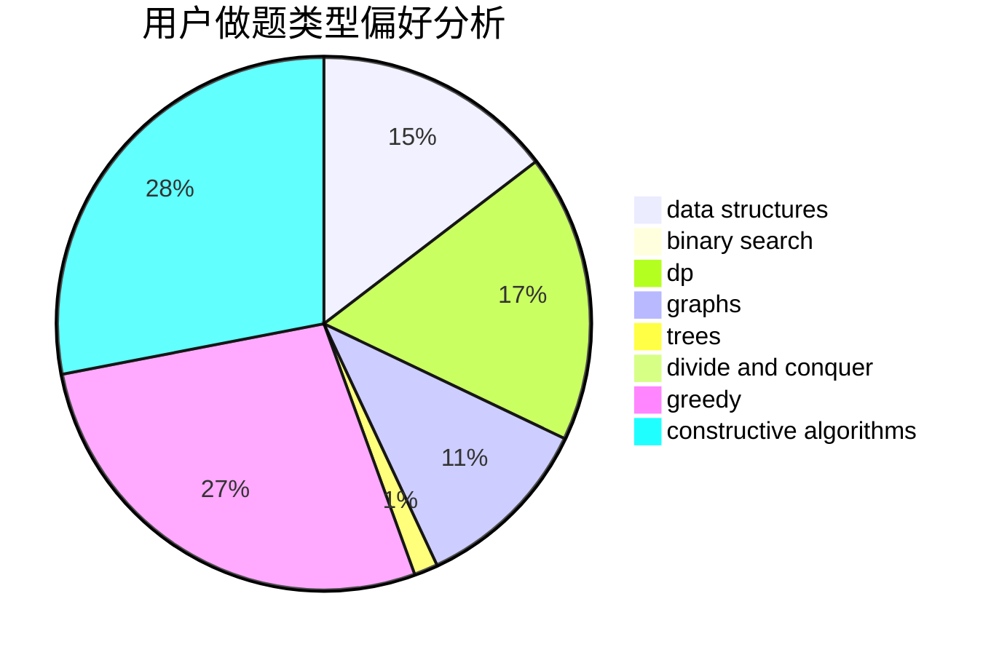
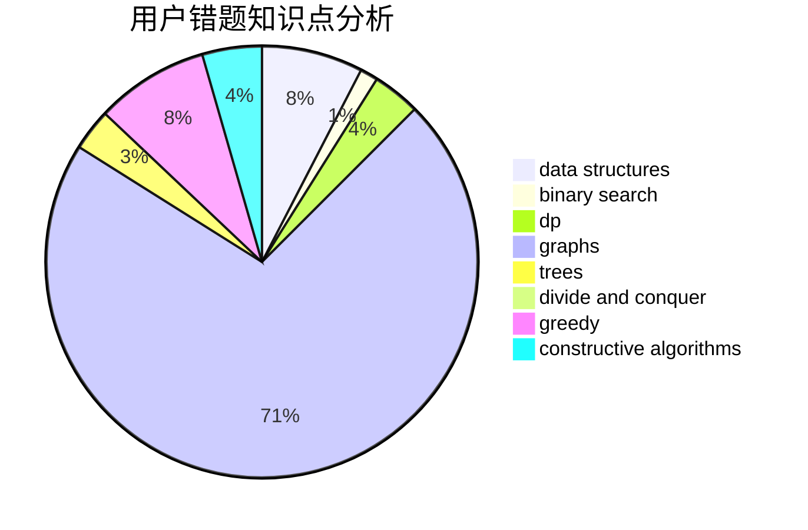

# sakuryu

<!-- tabs:start -->

#### **用户提交结果分析**

#### **用户做题类型偏好分析**

#### **用户错题知识点分析**

<!-- tabs:end -->
# 推荐题目
[1371C](https://codeforces.com/contest/1371/problem/C)		greedy,
                        implementation,
                        math		  
[982A](https://codeforces.com/contest/982/problem/A)		brute force,
                        constructive algorithms		  
[107B](https://codeforces.com/contest/107/problem/B)		combinatorics,
                        dp,
                        math,
                        probabilities		  
[132C](https://codeforces.com/contest/132/problem/C)		dp		  
[1466H](https://codeforces.com/contest/1466/problem/H)		combinatorics,
                        dp,
                        graphs,
                        greedy,
                        math		  
[225E](https://codeforces.com/contest/225/problem/E)		math,
                        number theory		  
[1382A](https://codeforces.com/contest/1382/problem/A)		brute force		  
[567B](https://codeforces.com/contest/567/problem/B)		implementation		  
[877C](https://codeforces.com/contest/877/problem/C)		constructive algorithms		  
[608D](https://codeforces.com/contest/608/problem/D)		dsu,graphs,sortings,trees		  
