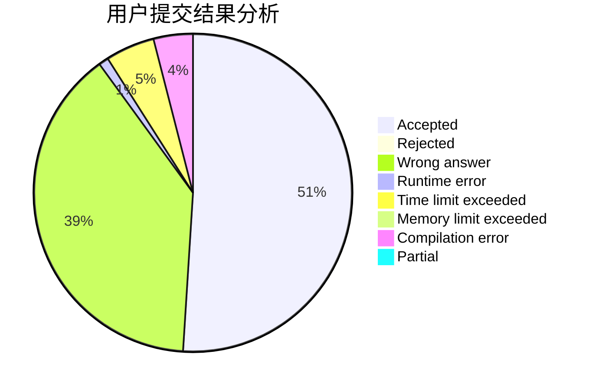
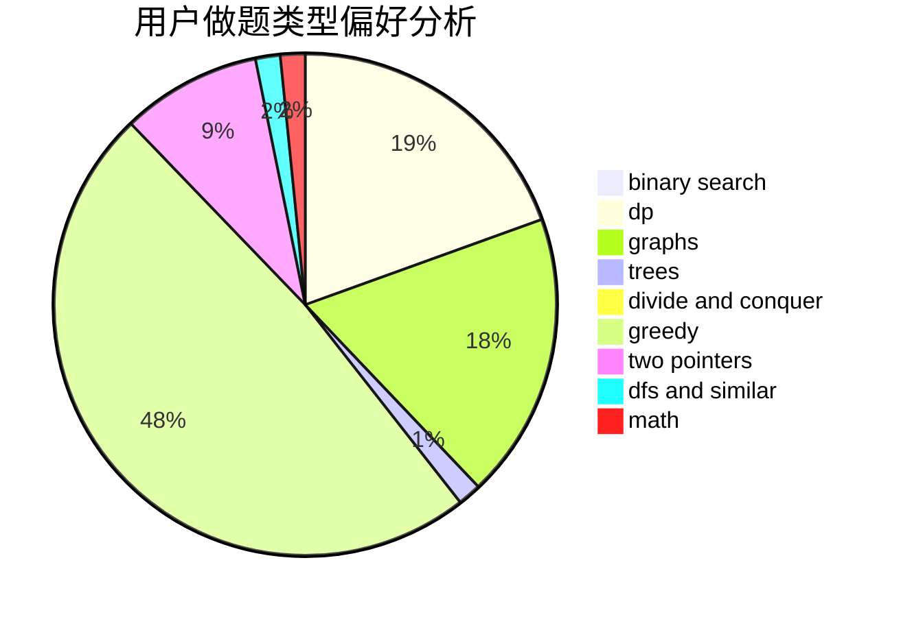

# sakuryu

<!-- tabs:start -->

#### **用户提交结果分析**

#### **用户做题类型偏好分析**

<!-- tabs:end -->
# 推荐题目
[1371C](https://codeforces.com/contest/1371/problem/C)
[982A](https://codeforces.com/contest/982/problem/A)
[107B](https://codeforces.com/contest/107/problem/B)
[132C](https://codeforces.com/contest/132/problem/C)
[1466H](https://codeforces.com/contest/1466/problem/H)
[225E](https://codeforces.com/contest/225/problem/E)
[1382A](https://codeforces.com/contest/1382/problem/A)
[567B](https://codeforces.com/contest/567/problem/B)
[877C](https://codeforces.com/contest/877/problem/C)
[608D](https://codeforces.com/contest/608/problem/D)
