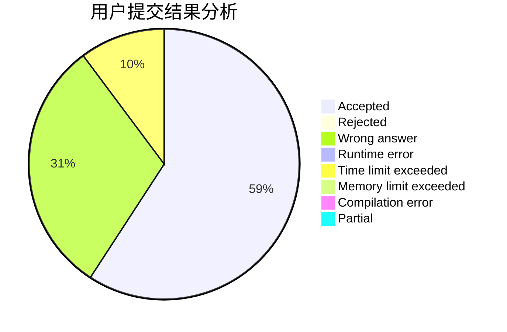
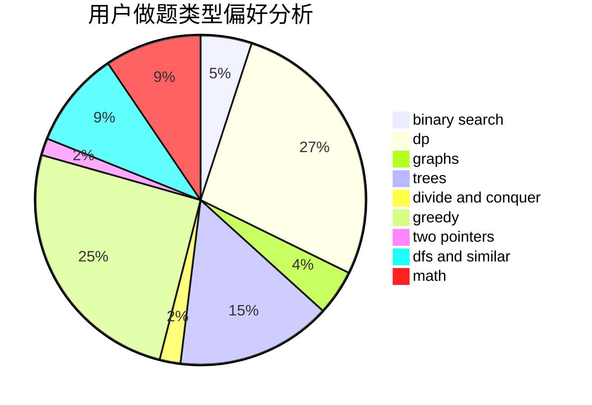

# salix_leaf

<!-- tabs:start -->

#### **用户提交结果分析**

#### **用户做题类型偏好分析**

<!-- tabs:end -->
# 推荐题目
[1443B](https://codeforces.com/contest/1443/problem/B)
[1416D](https://codeforces.com/contest/1416/problem/D)
[732B](https://codeforces.com/contest/732/problem/B)
[720C](https://codeforces.com/contest/720/problem/C)
[914H](https://codeforces.com/contest/914/problem/H)
[781C](https://codeforces.com/contest/781/problem/C)
[660E](https://codeforces.com/contest/660/problem/E)
[158E](https://codeforces.com/contest/158/problem/E)
[80B](https://codeforces.com/contest/80/problem/B)
[12542](https://codeforces.com/contest/1254/problem/2)
