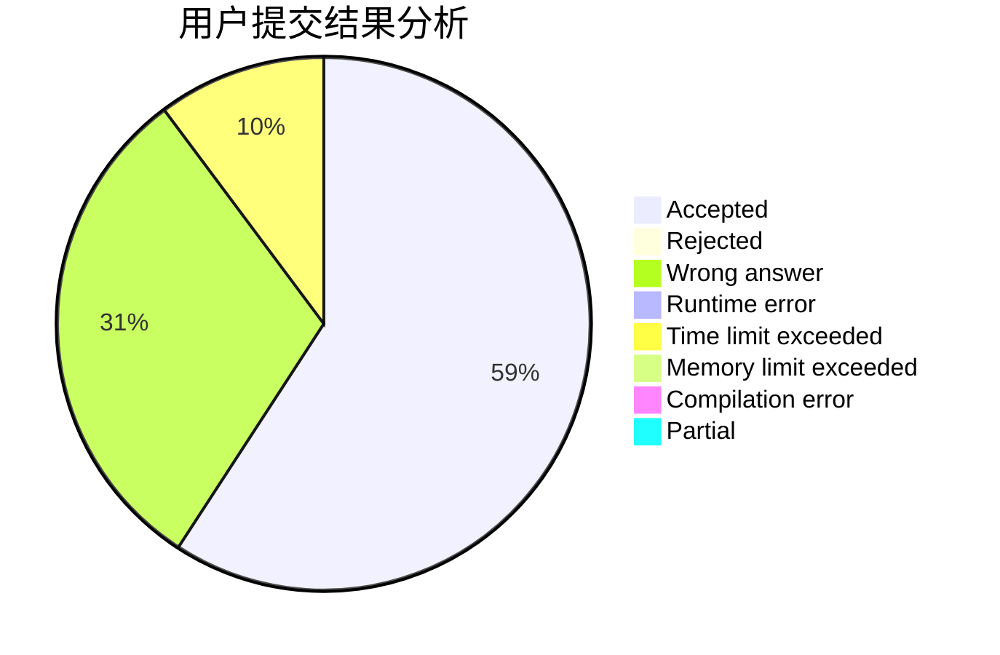
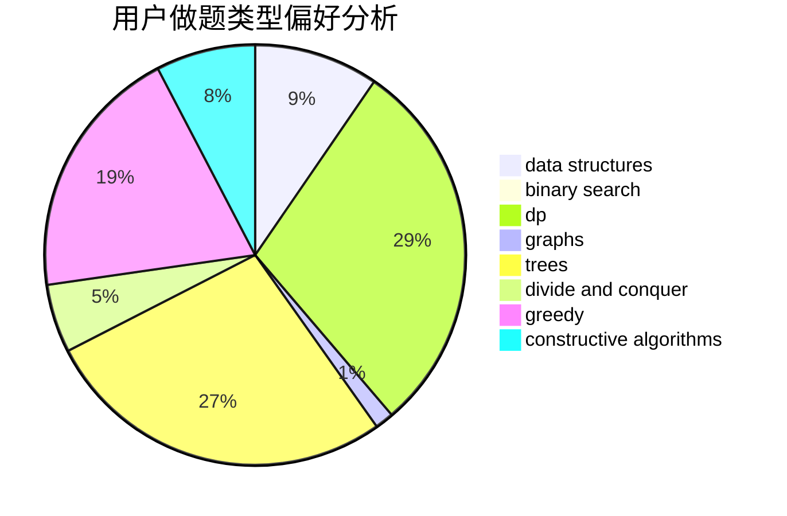

# salix_leaf

<!-- tabs:start -->

#### **用户提交结果分析**

#### **用户做题类型偏好分析**

#### **用户错题知识点分析**

<!-- tabs:end -->
# 推荐题目
[1443B](https://codeforces.com/contest/1443/problem/B)		dp,
                        greedy,
                        math,
                        sortings		  
[1416D](https://codeforces.com/contest/1416/problem/D)		data structures,
                        dsu,
                        graphs,
                        implementation,
                        trees		  
[732B](https://codeforces.com/contest/732/problem/B)		dp,
                        greedy		  
[720C](https://codeforces.com/contest/720/problem/C)		constructive algorithms		  
[914H](https://codeforces.com/contest/914/problem/H)		combinatorics,
                        dp,
                        games,
                        trees		  
[781C](https://codeforces.com/contest/781/problem/C)		dsu,graphs,sortings,trees		  
[660E](https://codeforces.com/contest/660/problem/E)		combinatorics		  
[158E](https://codeforces.com/contest/158/problem/E)		*special problem,
                        dp,
                        sortings		  
[80B](https://codeforces.com/contest/80/problem/B)		geometry,
                        math		  
[12542](https://codeforces.com/contest/1254/problem/2)		dsu,graphs,sortings,trees		  
