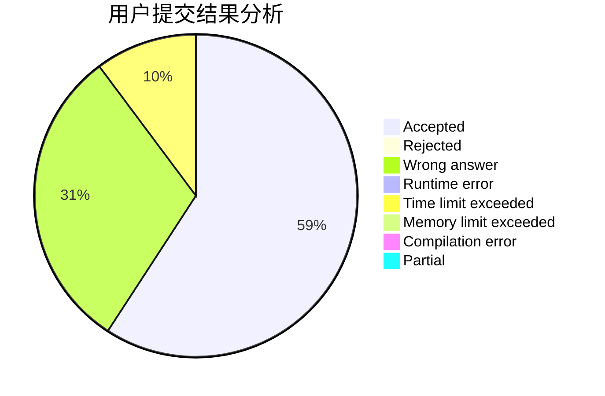
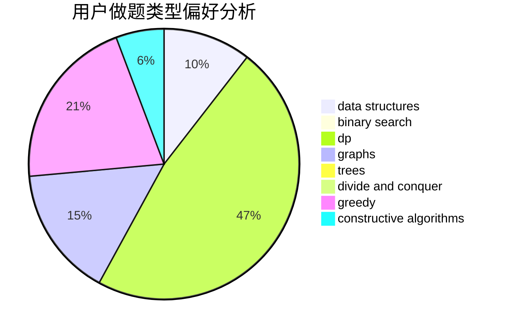

# salix_leaf

<!-- tabs:start -->

#### **用户提交结果分析**

#### **用户做题类型偏好分析**

#### **用户错题知识点分析**

<!-- tabs:end -->
# 推荐题目
[1433C](https://codeforces.com/contest/1433/problem/C)		constructive algorithms,
                        greedy		  
[1405C](https://codeforces.com/contest/1405/problem/C)		dsu,graphs,sortings,trees		  
[713A](https://codeforces.com/contest/713/problem/A)		data structures,
                        implementation		  
[701F](https://codeforces.com/contest/701/problem/F)		dsu,graphs,sortings,trees		  
[898F](https://codeforces.com/contest/898/problem/F)		brute force,
                        hashing,
                        math		  
[762E](https://codeforces.com/contest/762/problem/E)		binary search,
                        data structures		  
[630J](https://codeforces.com/contest/630/problem/J)		math,
                        number theory		  
[1508A](https://codeforces.com/contest/1508/problem/A)		constructive algorithms,
                        greedy,
                        implementation,
                        math,
                        strings,
                        two pointers		  
[795D](https://codeforces.com/contest/795/problem/D)		dsu,graphs,sortings,trees		  
[1250B](https://codeforces.com/contest/1250/problem/B)		brute force,
                        constructive algorithms,
                        greedy,
                        math		  
