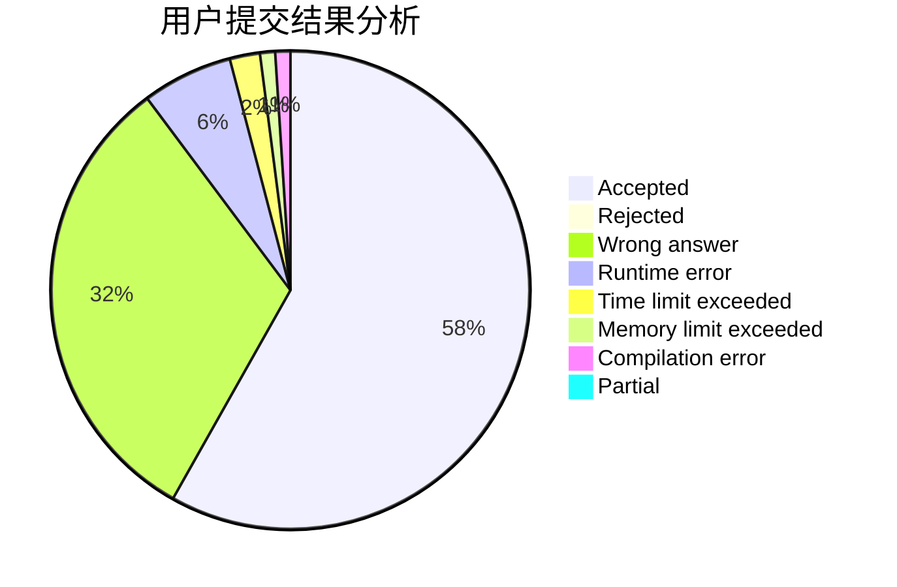
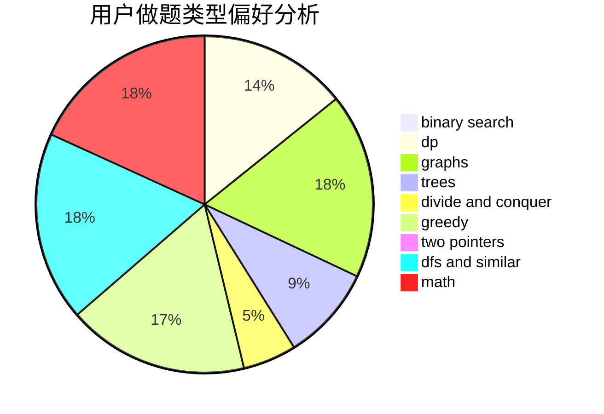

# samnever

<!-- tabs:start -->

#### **用户提交结果分析**

#### **用户做题类型偏好分析**

<!-- tabs:end -->
# 推荐题目
[940E](https://codeforces.com/contest/940/problem/E)
[817A](https://codeforces.com/contest/817/problem/A)
[603E](https://codeforces.com/contest/603/problem/E)
[329B](https://codeforces.com/contest/329/problem/B)
[916D](https://codeforces.com/contest/916/problem/D)
[998B](https://codeforces.com/contest/998/problem/B)
[540B](https://codeforces.com/contest/540/problem/B)
[318A](https://codeforces.com/contest/318/problem/A)
[455B](https://codeforces.com/contest/455/problem/B)
[333B](https://codeforces.com/contest/333/problem/B)
