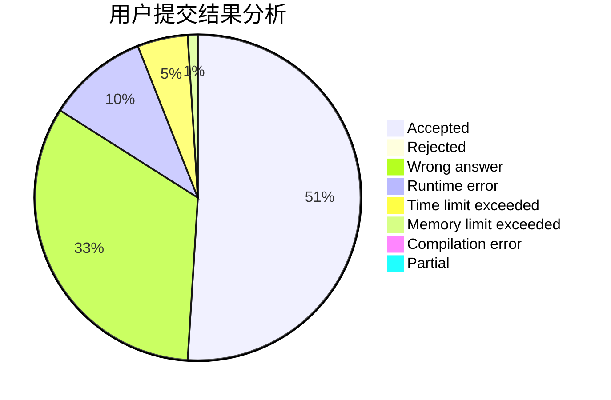
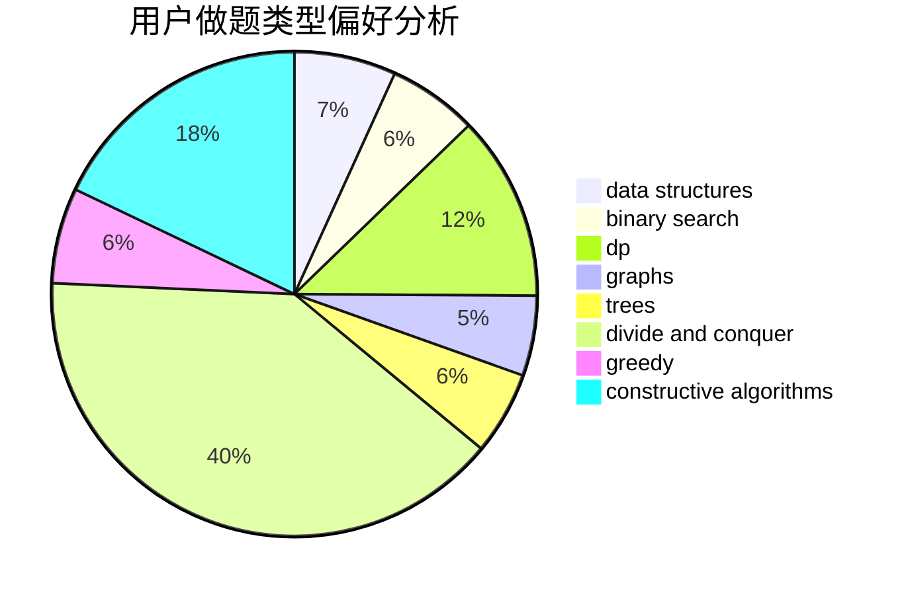
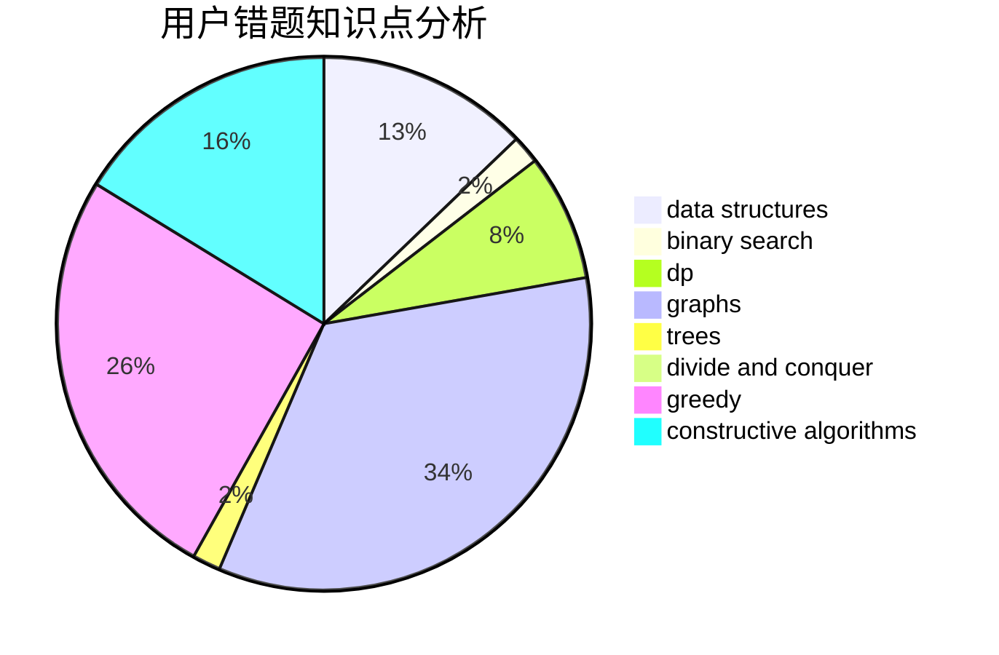

# CCS_Covenant

<!-- tabs:start -->

#### **用户提交结果分析**

#### **用户做题类型偏好分析**

#### **用户错题知识点分析**

<!-- tabs:end -->
# 推荐题目
[269E](https://codeforces.com/contest/269/problem/E)		nan		  
[1416F](https://codeforces.com/contest/1416/problem/F)		flows,
                        graph matchings,
                        greedy,
                        implementation		  
[581B](https://codeforces.com/contest/581/problem/B)		implementation,
                        math		  
[228B](https://codeforces.com/contest/228/problem/B)		brute force,
                        implementation		  
[309C](https://codeforces.com/contest/309/problem/C)		binary search,
                        bitmasks,
                        greedy		  
[590D](https://codeforces.com/contest/590/problem/D)		dp		  
[180C](https://codeforces.com/contest/180/problem/C)		dp		  
[1184E1](https://codeforces.com/contest/1184E/problem/1)		graphs,
                        trees		  
[1493F](https://codeforces.com/contest/1493/problem/F)		bitmasks,
                        interactive,
                        number theory		  
[58E](https://codeforces.com/contest/58/problem/E)		dp		  
