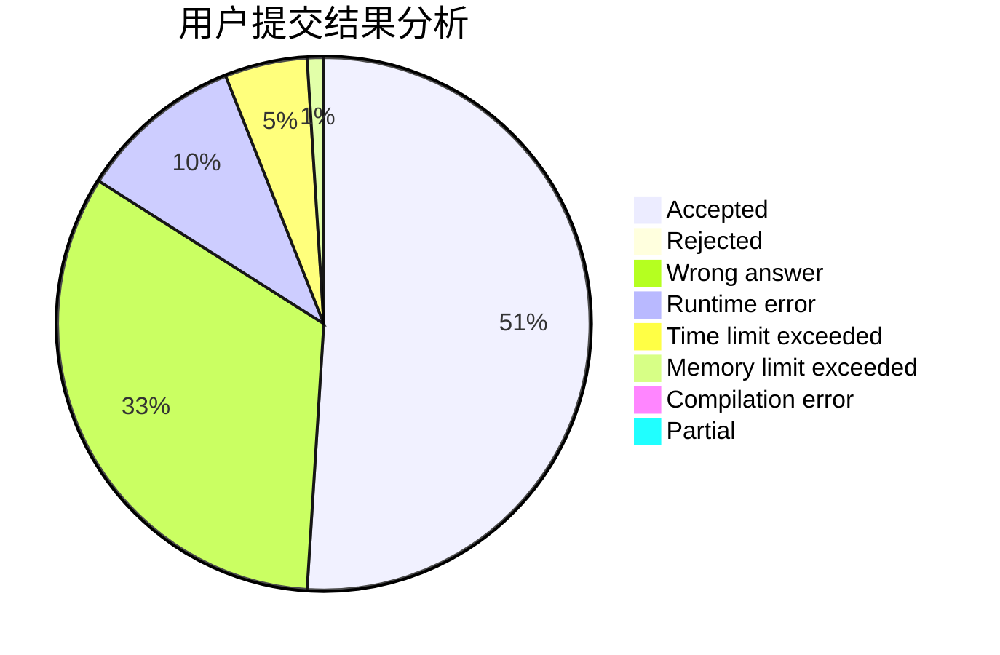
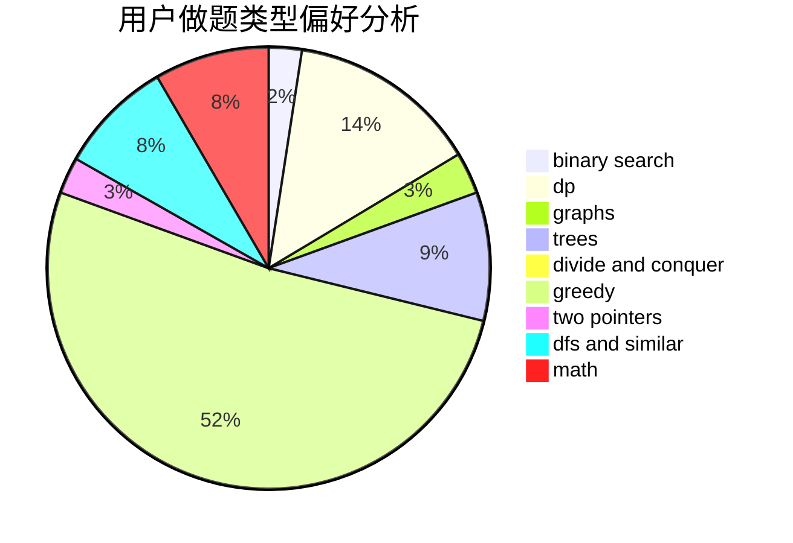

# CCS_Covenant

<!-- tabs:start -->

#### **用户提交结果分析**

#### **用户做题类型偏好分析**

<!-- tabs:end -->
# 推荐题目
[286A](https://codeforces.com/contest/286/problem/A)
[1424G](https://codeforces.com/contest/1424/problem/G)
[601C](https://codeforces.com/contest/601/problem/C)
[246C](https://codeforces.com/contest/246/problem/C)
[32B](https://codeforces.com/contest/32/problem/B)
[610B](https://codeforces.com/contest/610/problem/B)
[205D](https://codeforces.com/contest/205/problem/D)
[1188C](https://codeforces.com/contest/1188/problem/C)
[1501F](https://codeforces.com/contest/1501/problem/F)
[609E](https://codeforces.com/contest/609/problem/E)
