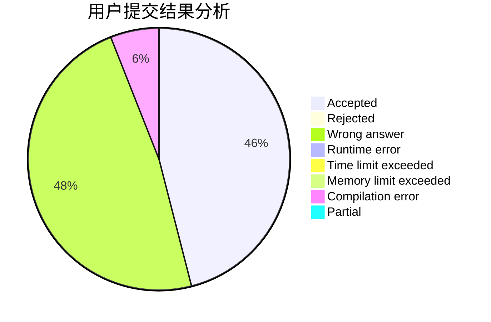
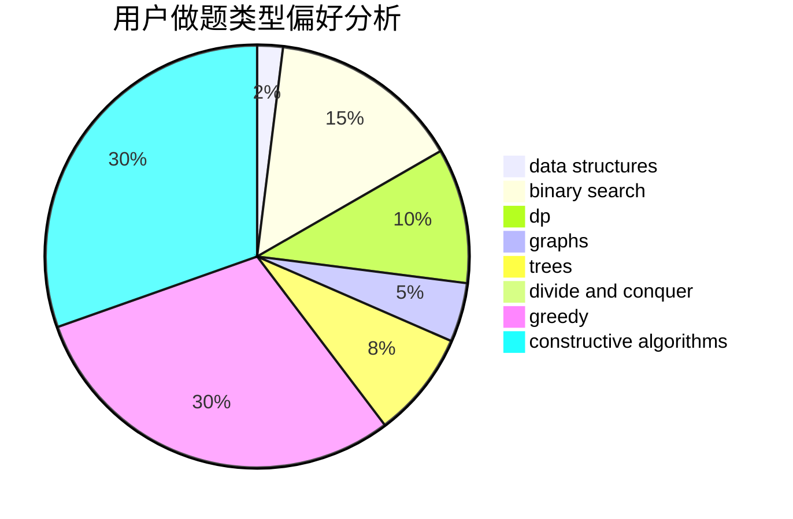

# sarailQAQ

<!-- tabs:start -->

#### **用户提交结果分析**

#### **用户做题类型偏好分析**

#### **用户错题知识点分析**

<!-- tabs:end -->
# 推荐题目
[1040B](https://codeforces.com/contest/1040/problem/B)		dp,
                        greedy,
                        math		  
[610B](https://codeforces.com/contest/610/problem/B)		constructive algorithms,
                        implementation		  
[3D](https://codeforces.com/contest/3/problem/D)		greedy		  
[713A](https://codeforces.com/contest/713/problem/A)		data structures,
                        implementation		  
[992A](https://codeforces.com/contest/992/problem/A)		implementation,
                        sortings		  
[631E](https://codeforces.com/contest/631/problem/E)		data structures,
                        dp,
                        geometry		  
[1236D](https://codeforces.com/contest/1236/problem/D)		brute force,
                        data structures,
                        greedy,
                        implementation		  
[847E](https://codeforces.com/contest/847/problem/E)		binary search,
                        dp		  
[1083F](https://codeforces.com/contest/1083/problem/F)		data structures		  
[901A](https://codeforces.com/contest/901/problem/A)		constructive algorithms,
                        trees		  
