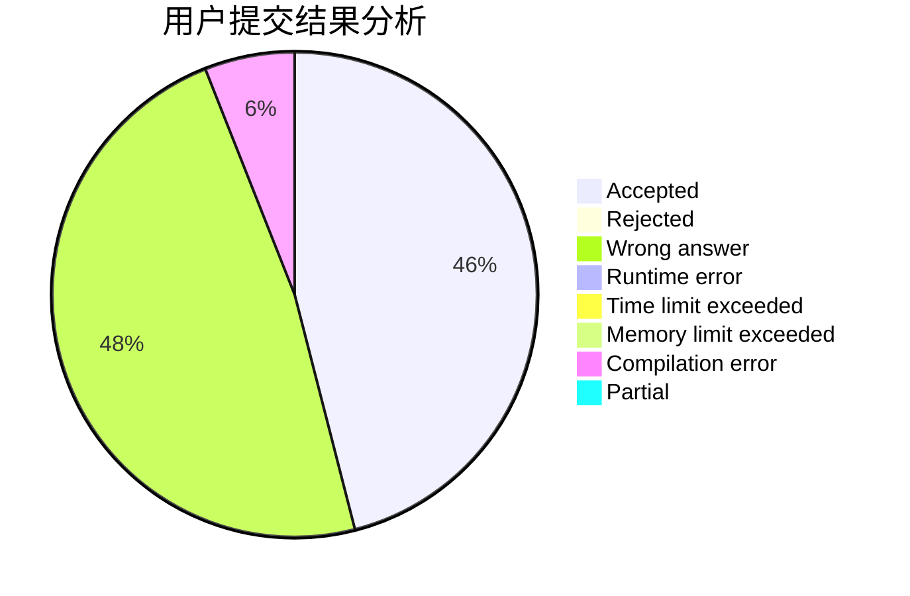
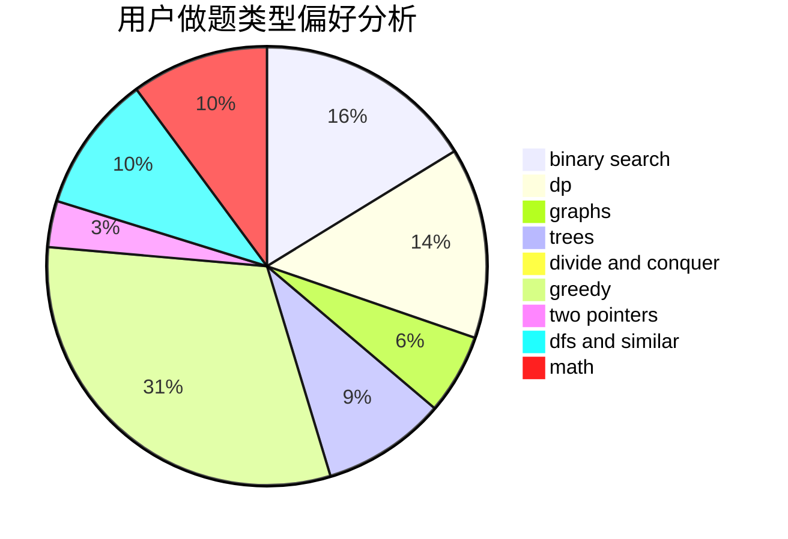

# sarailQAQ

<!-- tabs:start -->

#### **用户提交结果分析**

#### **用户做题类型偏好分析**

<!-- tabs:end -->
# 推荐题目
[1040B](https://codeforces.com/contest/1040/problem/B)
[610B](https://codeforces.com/contest/610/problem/B)
[3D](https://codeforces.com/contest/3/problem/D)
[713A](https://codeforces.com/contest/713/problem/A)
[992A](https://codeforces.com/contest/992/problem/A)
[631E](https://codeforces.com/contest/631/problem/E)
[1236D](https://codeforces.com/contest/1236/problem/D)
[847E](https://codeforces.com/contest/847/problem/E)
[1083F](https://codeforces.com/contest/1083/problem/F)
[901A](https://codeforces.com/contest/901/problem/A)
