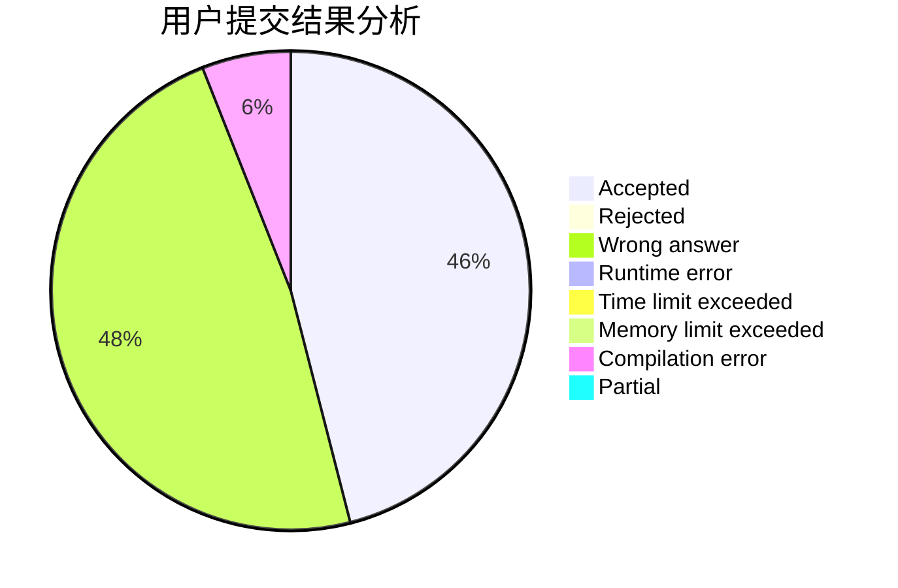
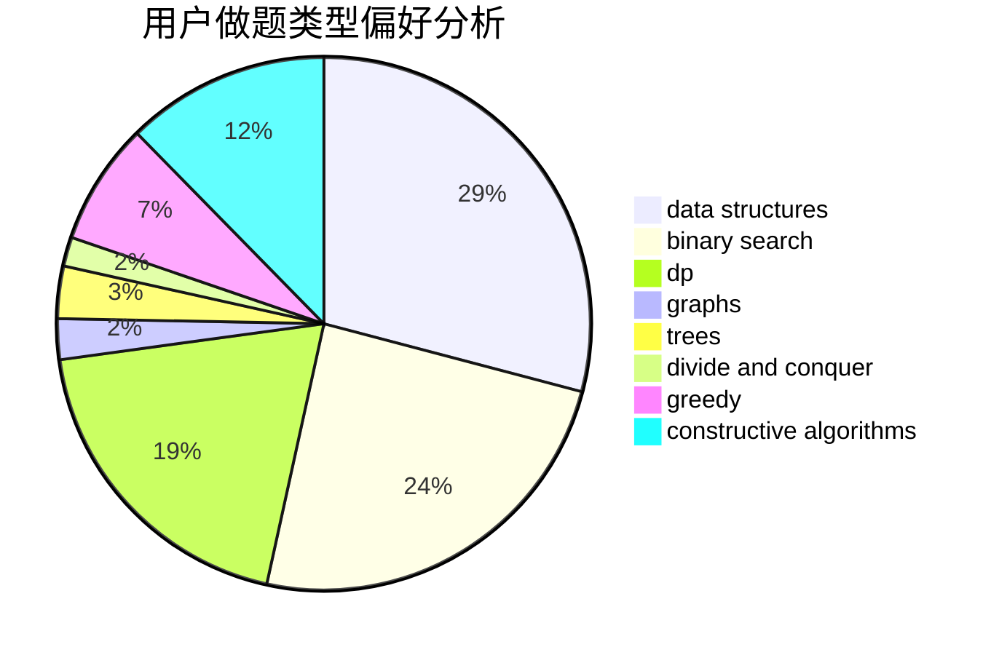
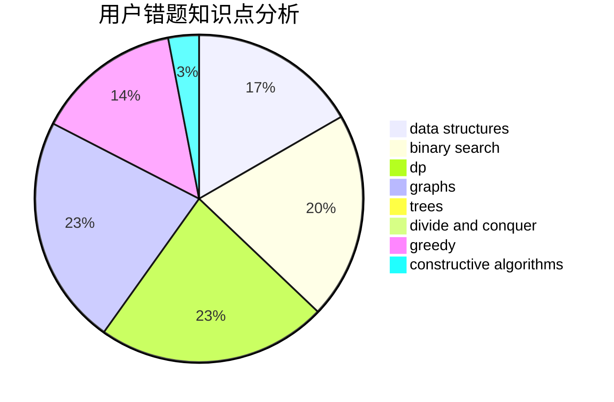

# sarailQAQ

<!-- tabs:start -->

#### **用户提交结果分析**

#### **用户做题类型偏好分析**

#### **用户错题知识点分析**

<!-- tabs:end -->
# 推荐题目
[103D](https://codeforces.com/contest/103/problem/D)		brute force,
                        data structures,
                        sortings		  
[590D](https://codeforces.com/contest/590/problem/D)		dp		  
[370B](https://codeforces.com/contest/370/problem/B)		implementation		  
[696C](https://codeforces.com/contest/696/problem/C)		combinatorics,
                        dp,
                        implementation,
                        math,
                        matrices		  
[978C](https://codeforces.com/contest/978/problem/C)		binary search,
                        implementation,
                        two pointers		  
[612C](https://codeforces.com/contest/612/problem/C)		data structures,
                        expression parsing,
                        math		  
[1227F2](https://codeforces.com/contest/1227F/problem/2)		combinatorics,
                        math		  
[828E](https://codeforces.com/contest/828/problem/E)		dsu,graphs,sortings,trees		  
[1083C](https://codeforces.com/contest/1083/problem/C)		data structures,
                        trees		  
[883G](https://codeforces.com/contest/883/problem/G)		dfs and similar,
                        graphs		  
