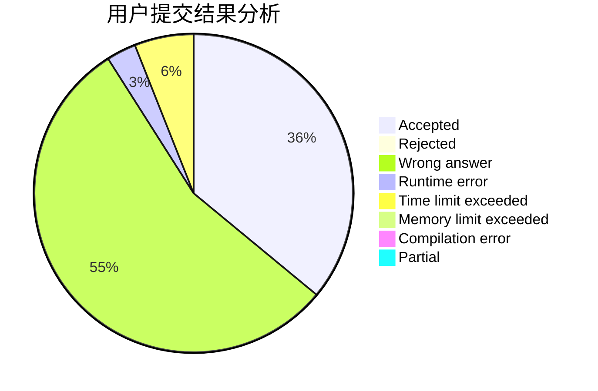
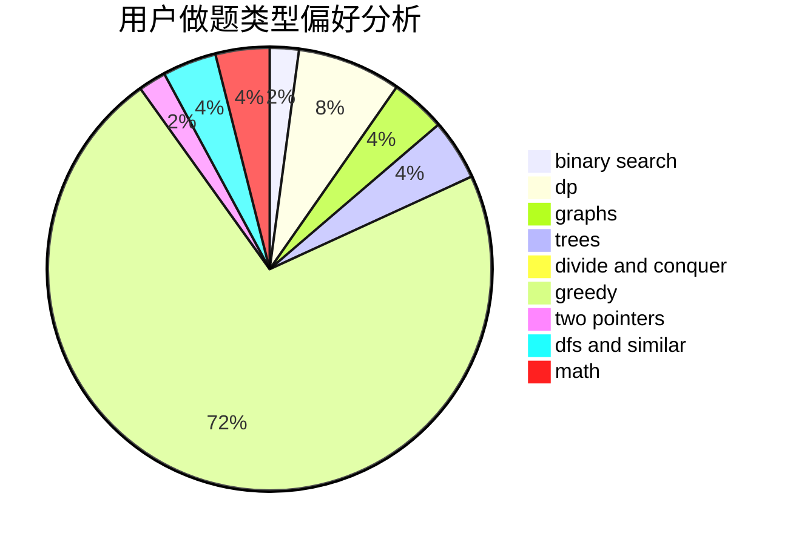

# sbit

<!-- tabs:start -->

#### **用户提交结果分析**

#### **用户做题类型偏好分析**

<!-- tabs:end -->
# 推荐题目
[463C](https://codeforces.com/contest/463/problem/C)
[1220E](https://codeforces.com/contest/1220/problem/E)
[578B](https://codeforces.com/contest/578/problem/B)
[1418A](https://codeforces.com/contest/1418/problem/A)
[1169B](https://codeforces.com/contest/1169/problem/B)
[437B](https://codeforces.com/contest/437/problem/B)
[911D](https://codeforces.com/contest/911/problem/D)
[522D](https://codeforces.com/contest/522/problem/D)
[273D](https://codeforces.com/contest/273/problem/D)
[12471](https://codeforces.com/contest/1247/problem/1)
