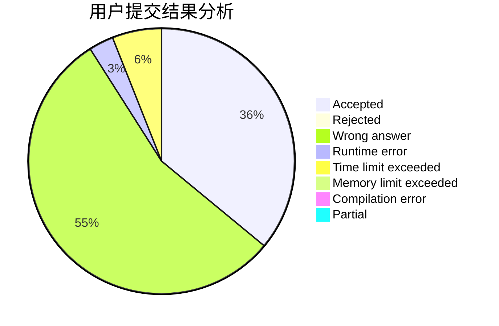
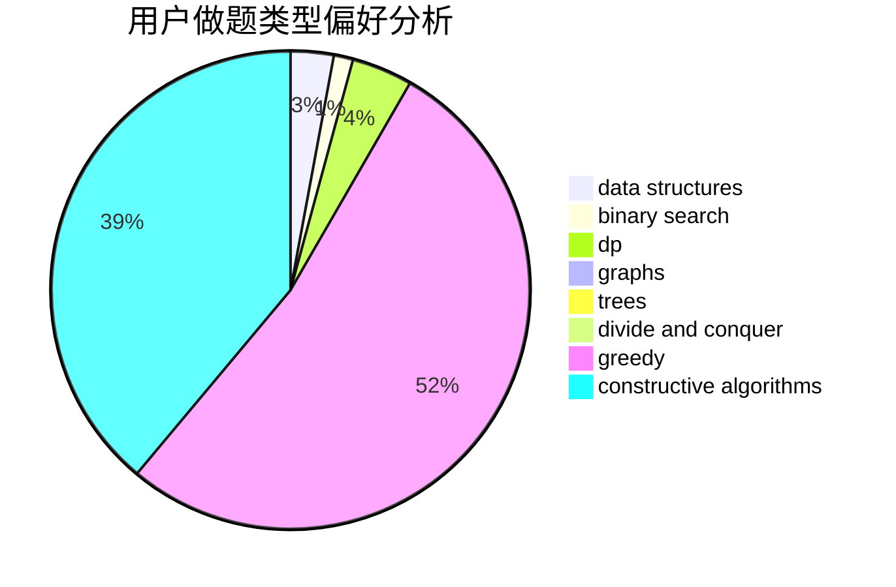
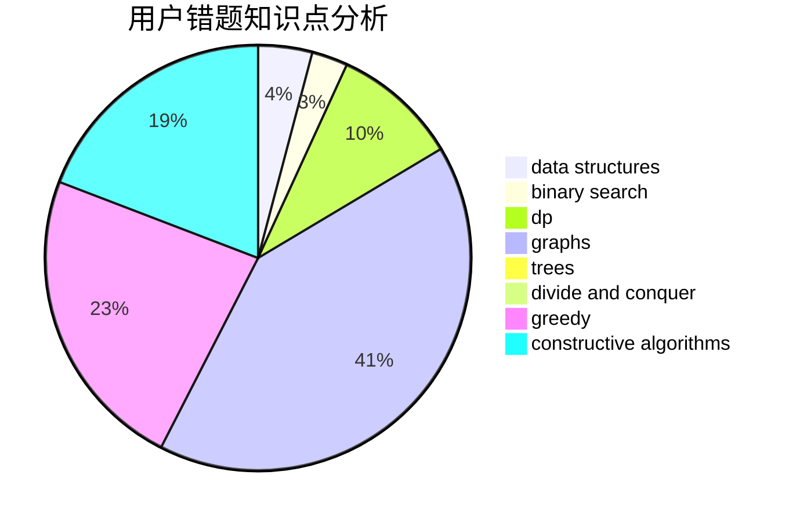

# sbit

<!-- tabs:start -->

#### **用户提交结果分析**

#### **用户做题类型偏好分析**

#### **用户错题知识点分析**

<!-- tabs:end -->
# 推荐题目
[463C](https://codeforces.com/contest/463/problem/C)		greedy,
                        hashing,
                        implementation		  
[1220E](https://codeforces.com/contest/1220/problem/E)		dfs and similar,
                        dp,
                        dsu,
                        graphs,
                        greedy,
                        trees		  
[578B](https://codeforces.com/contest/578/problem/B)		brute force,
                        greedy		  
[1418A](https://codeforces.com/contest/1418/problem/A)		math		  
[1169B](https://codeforces.com/contest/1169/problem/B)		graphs,
                        implementation		  
[437B](https://codeforces.com/contest/437/problem/B)		bitmasks,
                        greedy,
                        implementation,
                        sortings		  
[911D](https://codeforces.com/contest/911/problem/D)		brute force,
                        math		  
[522D](https://codeforces.com/contest/522/problem/D)		*special problem,
                        data structures		  
[273D](https://codeforces.com/contest/273/problem/D)		dp		  
[12471](https://codeforces.com/contest/1247/problem/1)		dsu,graphs,sortings,trees		  
