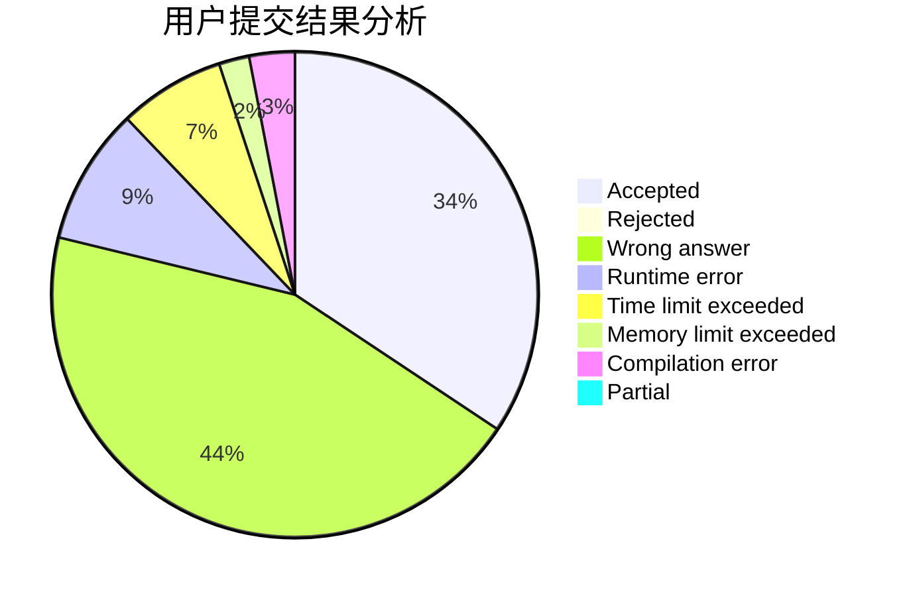
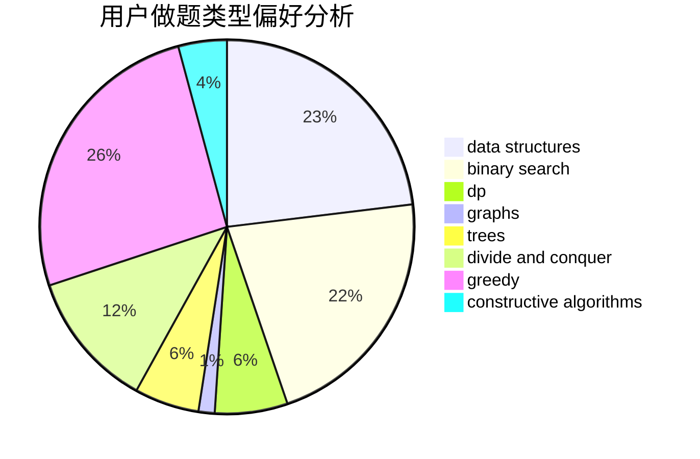

# scew_ru

<!-- tabs:start -->

#### **用户提交结果分析**

#### **用户做题类型偏好分析**

#### **用户错题知识点分析**

<!-- tabs:end -->
# 推荐题目
[1139F](https://codeforces.com/contest/1139/problem/F)		data structures,
                        divide and conquer		  
[701A](https://codeforces.com/contest/701/problem/A)		greedy,
                        implementation		  
[13561](https://codeforces.com/contest/1356/problem/1)		dsu,graphs,sortings,trees		  
[290C](https://codeforces.com/contest/290/problem/C)		*special problem,
                        graph matchings,
                        implementation,
                        trees		  
[851D](https://codeforces.com/contest/851/problem/D)		dsu,graphs,sortings,trees		  
[463B](https://codeforces.com/contest/463/problem/B)		brute force,
                        implementation,
                        math		  
[294C](https://codeforces.com/contest/294/problem/C)		combinatorics,
                        number theory		  
[109A](https://codeforces.com/contest/109/problem/A)		brute force,
                        implementation		  
[630G](https://codeforces.com/contest/630/problem/G)		combinatorics,
                        math		  
[672D](https://codeforces.com/contest/672/problem/D)		dsu,graphs,sortings,trees		  
