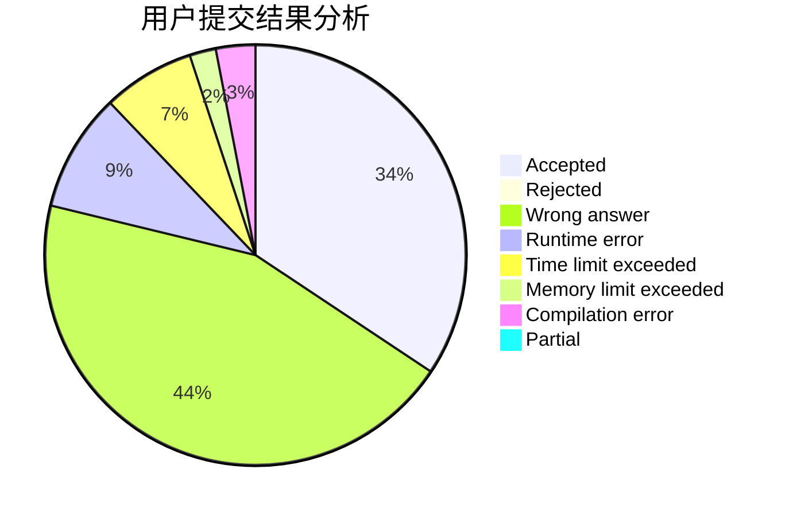
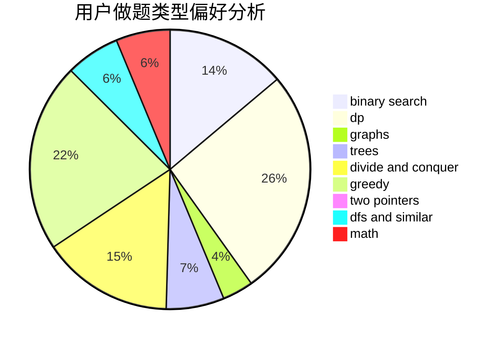

# scew_ru

<!-- tabs:start -->

#### **用户提交结果分析**

#### **用户做题类型偏好分析**

<!-- tabs:end -->
# 推荐题目
[1139F](https://codeforces.com/contest/1139/problem/F)
[701A](https://codeforces.com/contest/701/problem/A)
[13561](https://codeforces.com/contest/1356/problem/1)
[290C](https://codeforces.com/contest/290/problem/C)
[851D](https://codeforces.com/contest/851/problem/D)
[463B](https://codeforces.com/contest/463/problem/B)
[294C](https://codeforces.com/contest/294/problem/C)
[109A](https://codeforces.com/contest/109/problem/A)
[630G](https://codeforces.com/contest/630/problem/G)
[672D](https://codeforces.com/contest/672/problem/D)
