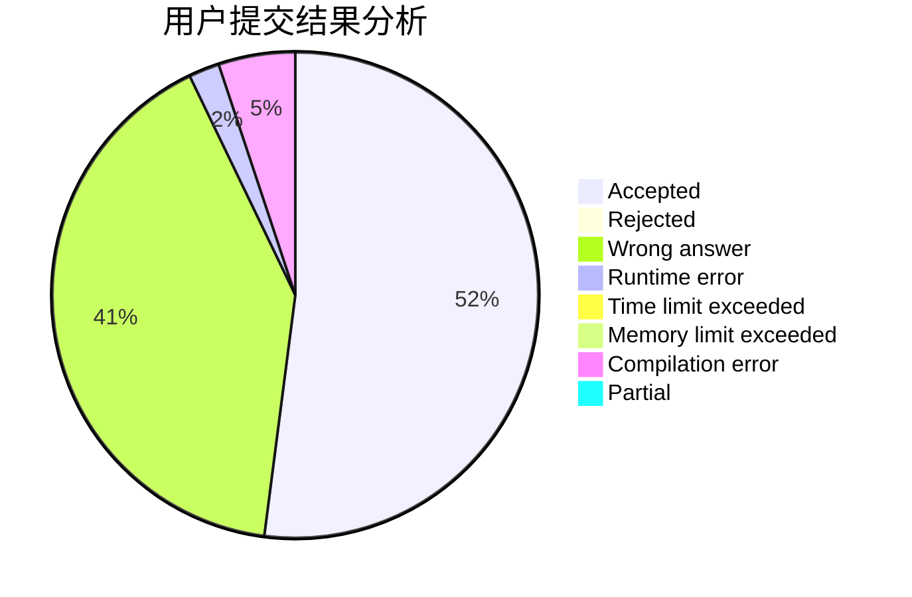
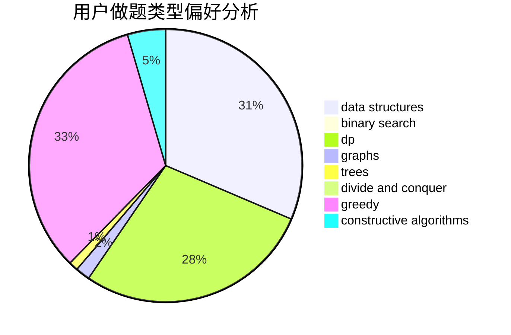
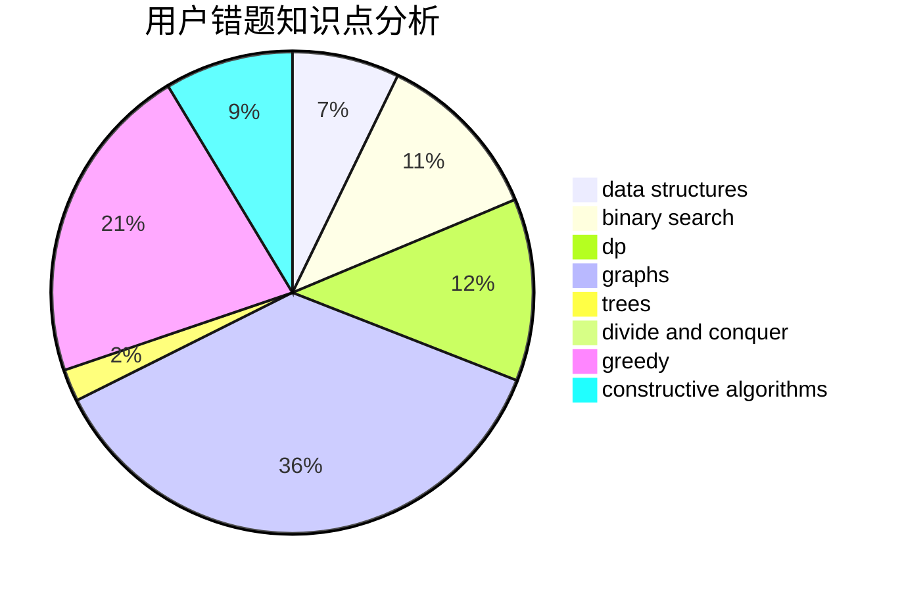

# scf0920

<!-- tabs:start -->

#### **用户提交结果分析**

#### **用户做题类型偏好分析**

#### **用户错题知识点分析**

<!-- tabs:end -->
# 推荐题目
[14791](https://codeforces.com/contest/1479/problem/1)		dsu,graphs,sortings,trees		  
[786C](https://codeforces.com/contest/786/problem/C)		data structures,
                        divide and conquer		  
[7A](https://codeforces.com/contest/7/problem/A)		brute force,
                        constructive algorithms		  
[1256B](https://codeforces.com/contest/1256/problem/B)		greedy		  
[603A](https://codeforces.com/contest/603/problem/A)		dp,
                        greedy,
                        math		  
[1440D](https://codeforces.com/contest/1440/problem/D)		dsu,graphs,sortings,trees		  
[498A](https://codeforces.com/contest/498/problem/A)		geometry		  
[1091B](https://codeforces.com/contest/1091/problem/B)		brute force,
                        constructive algorithms,
                        greedy,
                        implementation		  
[353D](https://codeforces.com/contest/353/problem/D)		constructive algorithms,
                        dp		  
[82A](https://codeforces.com/contest/82/problem/A)		implementation,
                        math		  
