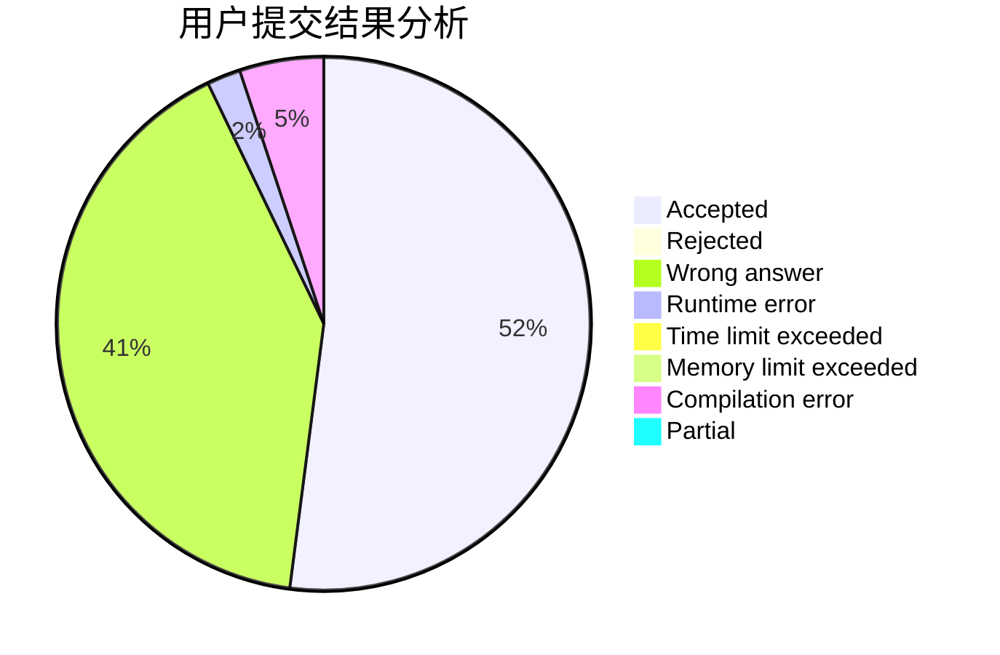
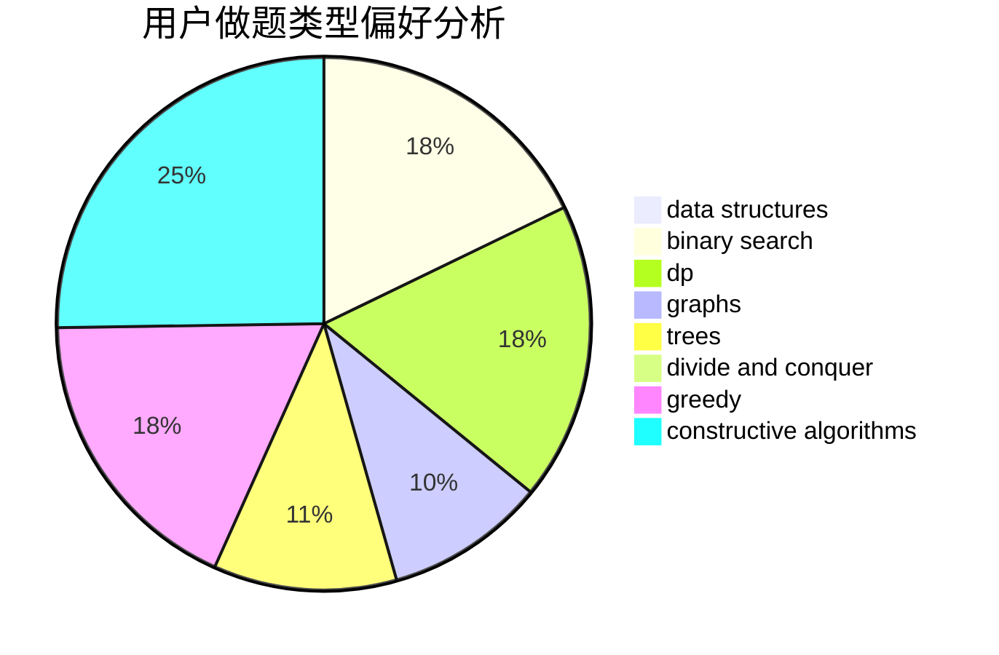
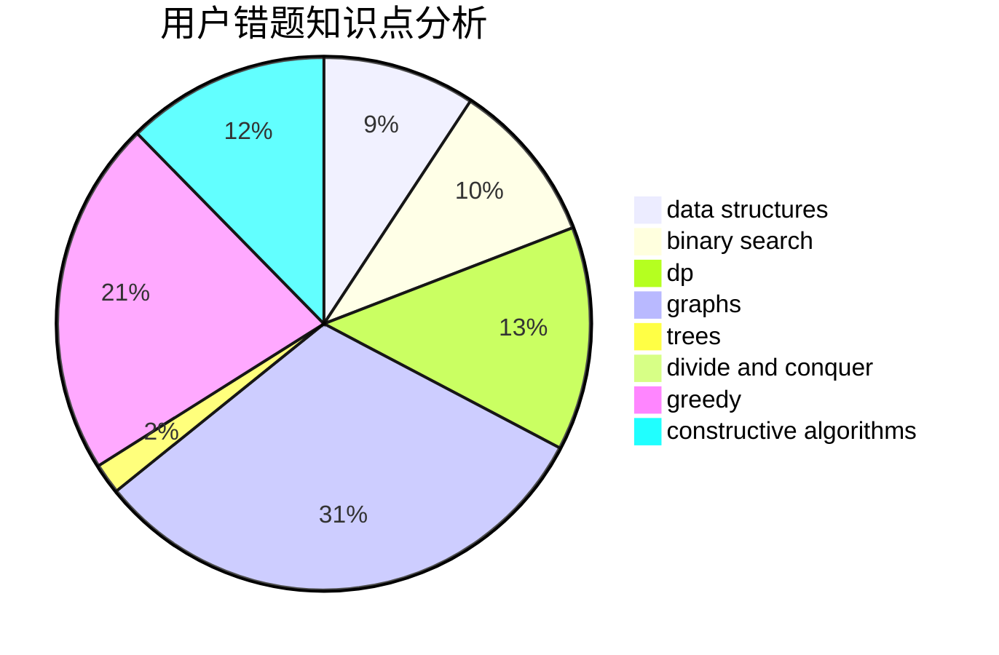

# scf0920

<!-- tabs:start -->

#### **用户提交结果分析**

#### **用户做题类型偏好分析**

#### **用户错题知识点分析**

<!-- tabs:end -->
# 推荐题目
[1470D](https://codeforces.com/contest/1470/problem/D)		constructive algorithms,
                        dfs and similar,
                        graph matchings,
                        graphs,
                        greedy		  
[767A](https://codeforces.com/contest/767/problem/A)		data structures,
                        implementation		  
[781C](https://codeforces.com/contest/781/problem/C)		dsu,graphs,sortings,trees		  
[1251A](https://codeforces.com/contest/1251/problem/A)		brute force,
                        strings,
                        two pointers		  
[582A](https://codeforces.com/contest/582/problem/A)		constructive algorithms,
                        greedy,
                        number theory		  
[1431G](https://codeforces.com/contest/1431/problem/G)		*special problem,
                        dp,
                        games,
                        greedy		  
[478A](https://codeforces.com/contest/478/problem/A)		implementation		  
[1090F](https://codeforces.com/contest/1090/problem/F)		constructive algorithms,
                        interactive		  
[321E](https://codeforces.com/contest/321/problem/E)		data structures,
                        divide and conquer,
                        dp		  
[811A](https://codeforces.com/contest/811/problem/A)		brute force,
                        implementation		  
