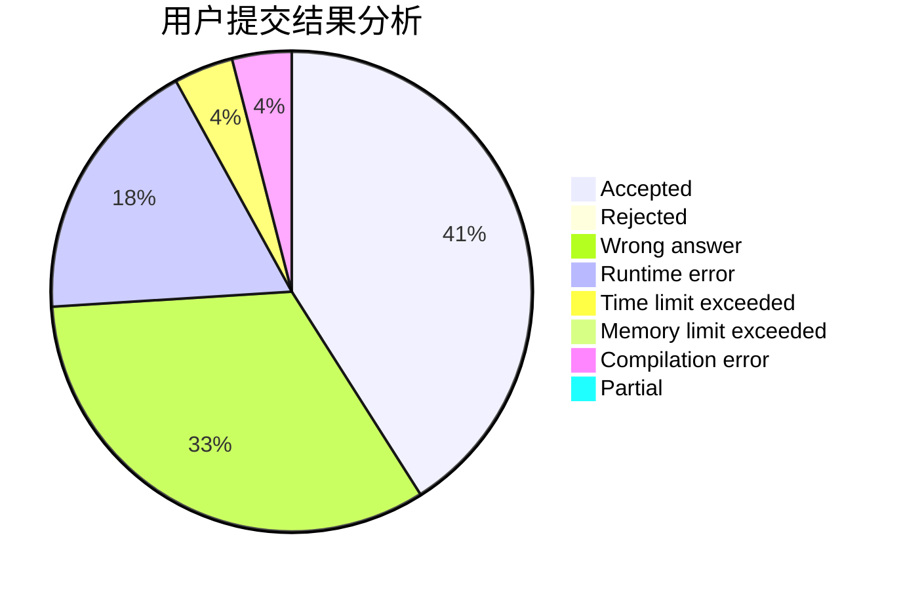
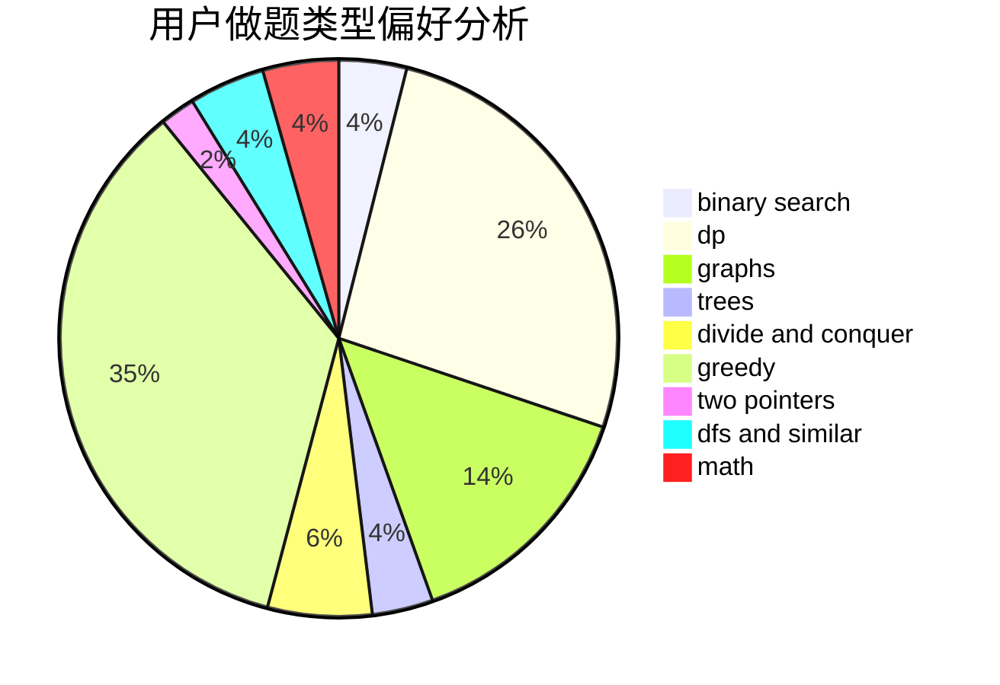

# scnucjh

<!-- tabs:start -->

#### **用户提交结果分析**

#### **用户做题类型偏好分析**

<!-- tabs:end -->
# 推荐题目
[1164M](https://codeforces.com/contest/1164/problem/M)
[801C](https://codeforces.com/contest/801/problem/C)
[1510A](https://codeforces.com/contest/1510/problem/A)
[114C](https://codeforces.com/contest/114/problem/C)
[14471](https://codeforces.com/contest/1447/problem/1)
[979D](https://codeforces.com/contest/979/problem/D)
[3311](https://codeforces.com/contest/331/problem/1)
[940D](https://codeforces.com/contest/940/problem/D)
[906C](https://codeforces.com/contest/906/problem/C)
[981F](https://codeforces.com/contest/981/problem/F)
