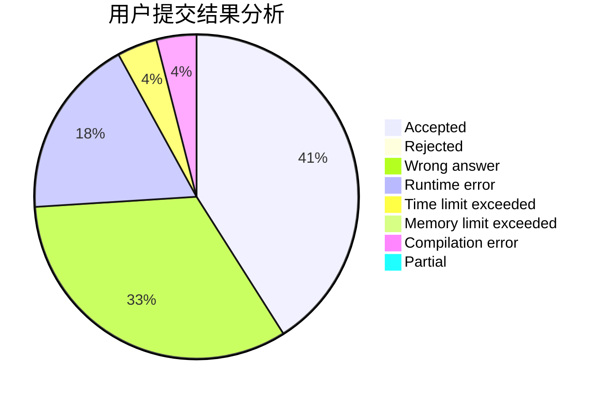
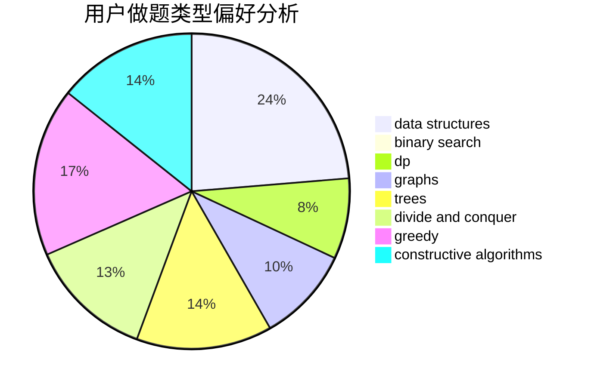
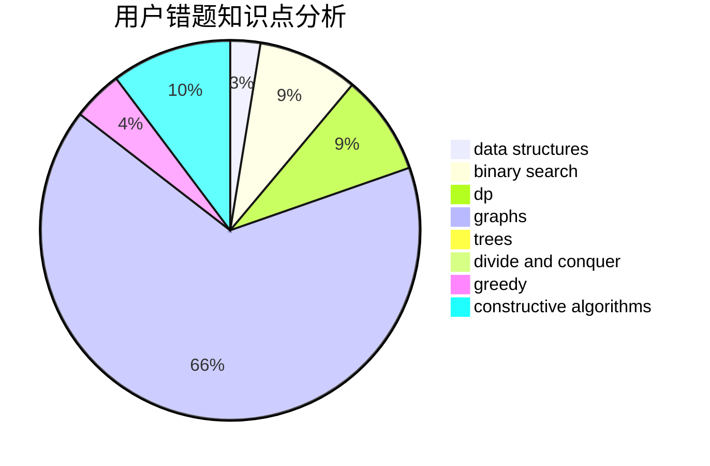

# scnucjh

<!-- tabs:start -->

#### **用户提交结果分析**

#### **用户做题类型偏好分析**

#### **用户错题知识点分析**

<!-- tabs:end -->
# 推荐题目
[1164M](https://codeforces.com/contest/1164/problem/M)		dsu,graphs,sortings,trees		  
[801C](https://codeforces.com/contest/801/problem/C)		dsu,graphs,sortings,trees		  
[1510A](https://codeforces.com/contest/1510/problem/A)		nan		  
[114C](https://codeforces.com/contest/114/problem/C)		dsu,graphs,sortings,trees		  
[14471](https://codeforces.com/contest/1447/problem/1)		dsu,graphs,sortings,trees		  
[979D](https://codeforces.com/contest/979/problem/D)		binary search,
                        bitmasks,
                        brute force,
                        data structures,
                        dp,
                        dsu,
                        greedy,
                        math,
                        number theory,
                        strings,
                        trees		  
[3311](https://codeforces.com/contest/331/problem/1)		dsu,graphs,sortings,trees		  
[940D](https://codeforces.com/contest/940/problem/D)		binary search,
                        implementation		  
[906C](https://codeforces.com/contest/906/problem/C)		bitmasks,
                        brute force,
                        dp,
                        graphs		  
[981F](https://codeforces.com/contest/981/problem/F)		binary search,
                        graph matchings,
                        greedy		  
