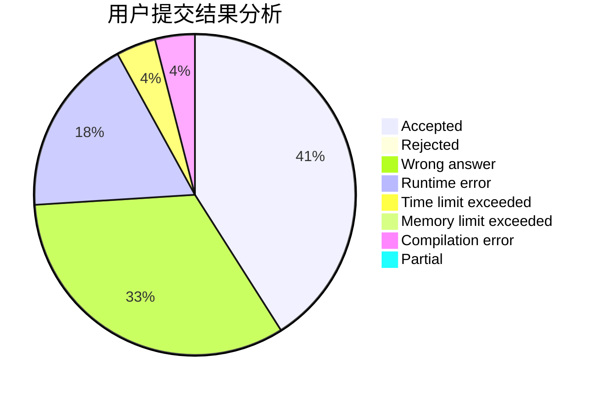
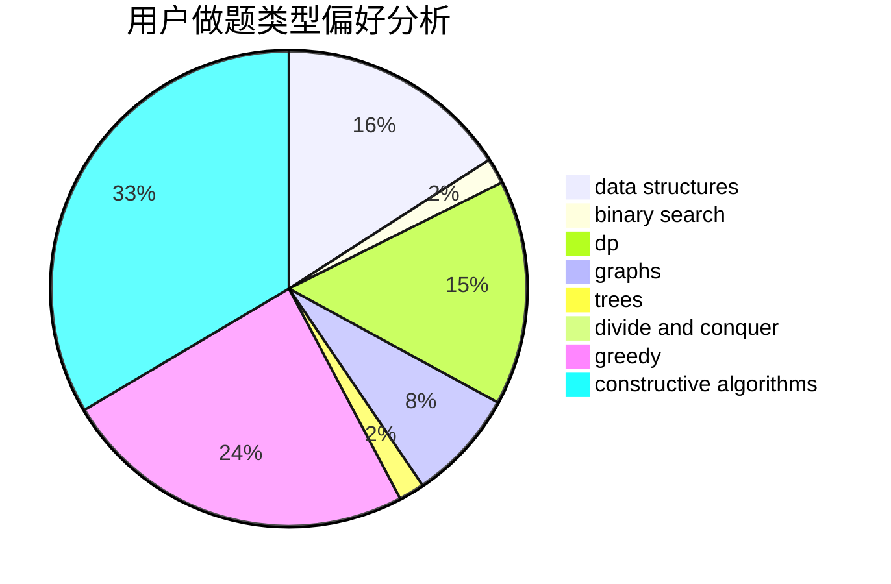
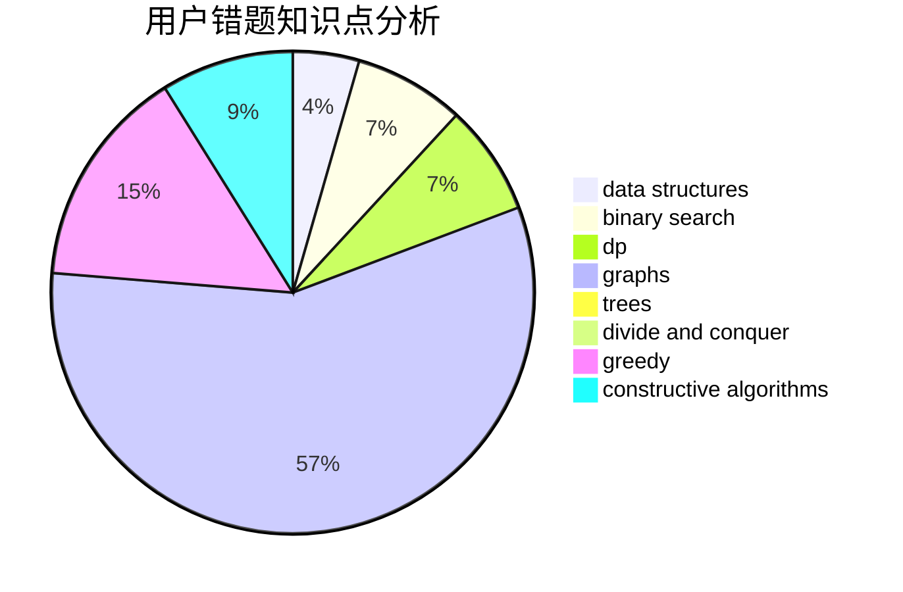

# scnucjh

<!-- tabs:start -->

#### **用户提交结果分析**

#### **用户做题类型偏好分析**

#### **用户错题知识点分析**

<!-- tabs:end -->
# 推荐题目
[1162E](https://codeforces.com/contest/1162/problem/E)		dsu,graphs,sortings,trees		  
[784C](https://codeforces.com/contest/784/problem/C)		*special problem,
                        implementation		  
[149E](https://codeforces.com/contest/149/problem/E)		string suffix structures,
                        strings		  
[1148C](https://codeforces.com/contest/1148/problem/C)		constructive algorithms,
                        sortings		  
[1437B](https://codeforces.com/contest/1437/problem/B)		constructive algorithms,
                        greedy		  
[958B1](https://codeforces.com/contest/958B/problem/1)		implementation		  
[309D](https://codeforces.com/contest/309/problem/D)		brute force,
                        geometry		  
[920E](https://codeforces.com/contest/920/problem/E)		data structures,
                        dfs and similar,
                        dsu,
                        graphs		  
[887B](https://codeforces.com/contest/887/problem/B)		brute force,
                        implementation		  
[95B](https://codeforces.com/contest/95/problem/B)		dp,
                        greedy		  
