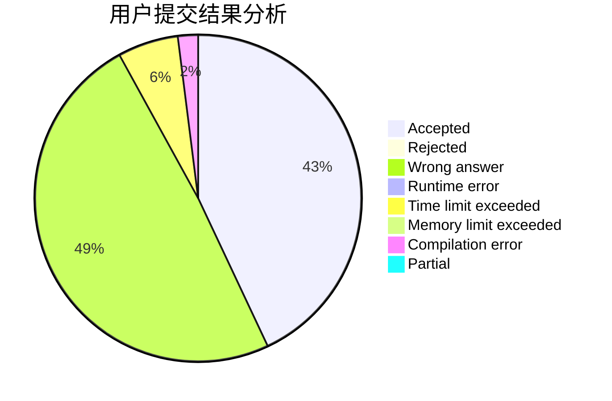
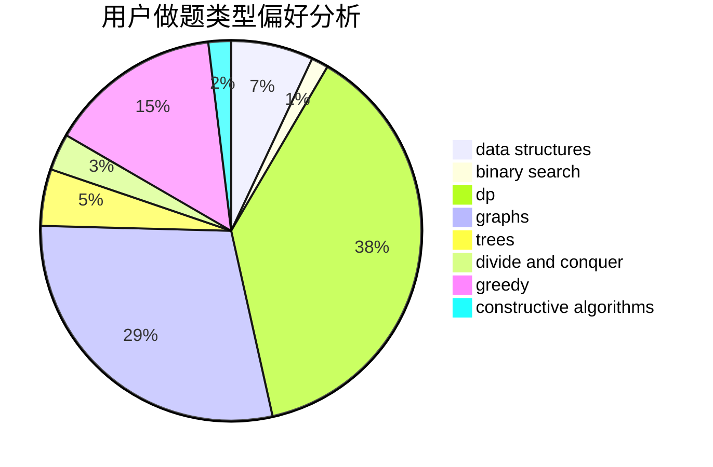

# scorpiowf

<!-- tabs:start -->

#### **用户提交结果分析**

#### **用户做题类型偏好分析**

#### **用户错题知识点分析**

<!-- tabs:end -->
# 推荐题目
[317A](https://codeforces.com/contest/317/problem/A)		brute force		  
[1333D](https://codeforces.com/contest/1333/problem/D)		brute force,
                        constructive algorithms,
                        games,
                        graphs,
                        greedy,
                        implementation,
                        sortings		  
[1210D](https://codeforces.com/contest/1210/problem/D)		graphs		  
[1139A](https://codeforces.com/contest/1139/problem/A)		implementation,
                        strings		  
[838E](https://codeforces.com/contest/838/problem/E)		dp		  
[1129E](https://codeforces.com/contest/1129/problem/E)		binary search,
                        interactive,
                        trees		  
[819B](https://codeforces.com/contest/819/problem/B)		data structures,
                        implementation,
                        math		  
[29E](https://codeforces.com/contest/29/problem/E)		graphs,
                        shortest paths		  
[1346C](https://codeforces.com/contest/1346/problem/C)		*special problem,
                        greedy,
                        sortings		  
[997E](https://codeforces.com/contest/997/problem/E)		data structures		  
