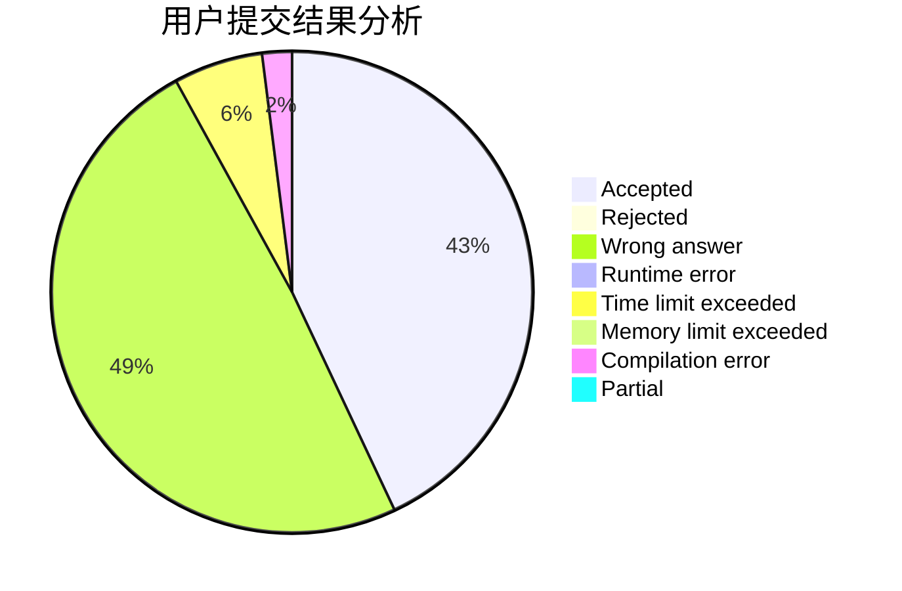
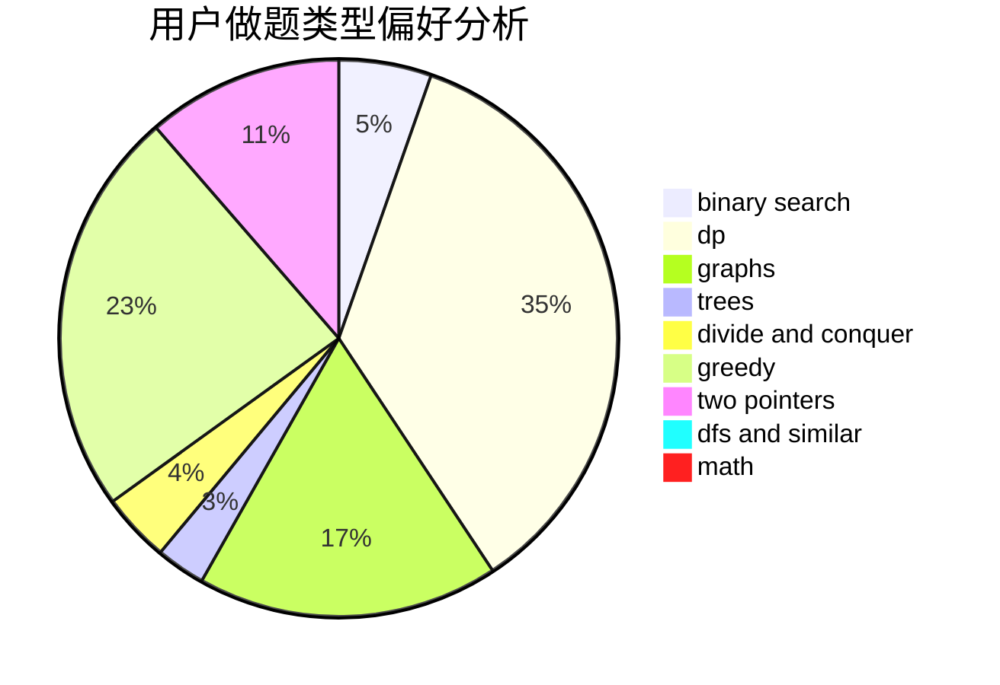

# scorpiowf

<!-- tabs:start -->

#### **用户提交结果分析**

#### **用户做题类型偏好分析**

<!-- tabs:end -->
# 推荐题目
[317A](https://codeforces.com/contest/317/problem/A)
[1333D](https://codeforces.com/contest/1333/problem/D)
[1210D](https://codeforces.com/contest/1210/problem/D)
[1139A](https://codeforces.com/contest/1139/problem/A)
[838E](https://codeforces.com/contest/838/problem/E)
[1129E](https://codeforces.com/contest/1129/problem/E)
[819B](https://codeforces.com/contest/819/problem/B)
[29E](https://codeforces.com/contest/29/problem/E)
[1346C](https://codeforces.com/contest/1346/problem/C)
[997E](https://codeforces.com/contest/997/problem/E)
