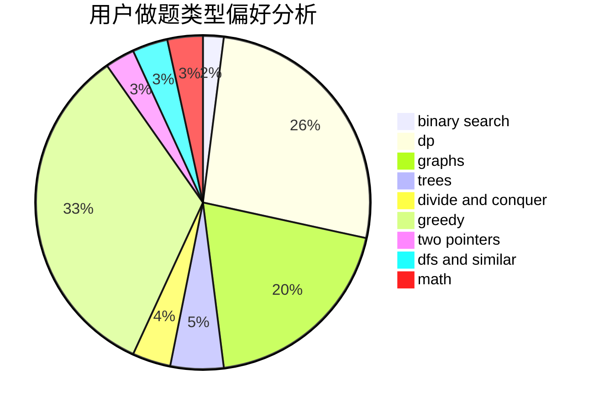

# scy_666

<!-- tabs:start -->

#### **用户提交结果分析**

#### **用户做题类型偏好分析**

<!-- tabs:end -->
# 推荐题目
[1005D](https://codeforces.com/contest/1005/problem/D)
[254B](https://codeforces.com/contest/254/problem/B)
[1156D](https://codeforces.com/contest/1156/problem/D)
[925C](https://codeforces.com/contest/925/problem/C)
[12B](https://codeforces.com/contest/12/problem/B)
[1072B](https://codeforces.com/contest/1072/problem/B)
[934B](https://codeforces.com/contest/934/problem/B)
[1099D](https://codeforces.com/contest/1099/problem/D)
[1416D](https://codeforces.com/contest/1416/problem/D)
[484D](https://codeforces.com/contest/484/problem/D)
