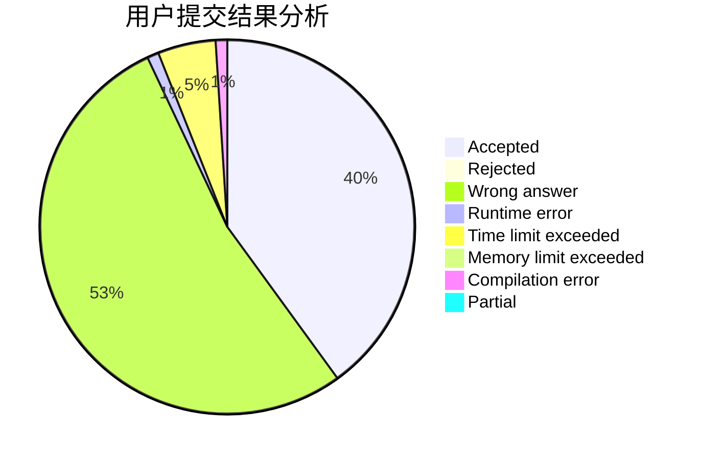
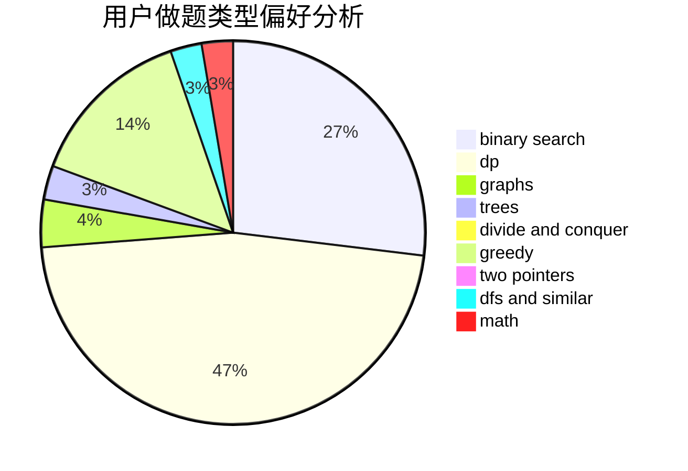

# scy_alicization

<!-- tabs:start -->

#### **用户提交结果分析**

#### **用户做题类型偏好分析**

<!-- tabs:end -->
# 推荐题目
[1458A](https://codeforces.com/contest/1458/problem/A)
[776C](https://codeforces.com/contest/776/problem/C)
[906C](https://codeforces.com/contest/906/problem/C)
[1033F](https://codeforces.com/contest/1033/problem/F)
[1310D](https://codeforces.com/contest/1310/problem/D)
[212E](https://codeforces.com/contest/212/problem/E)
[883D](https://codeforces.com/contest/883/problem/D)
[594E](https://codeforces.com/contest/594/problem/E)
[686D](https://codeforces.com/contest/686/problem/D)
[558A](https://codeforces.com/contest/558/problem/A)
