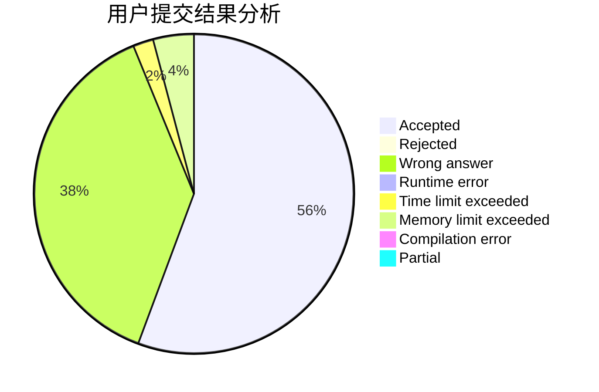
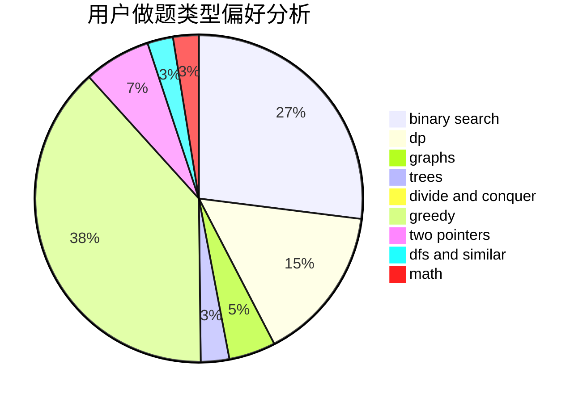

# sd197555

<!-- tabs:start -->

#### **用户提交结果分析**

#### **用户做题类型偏好分析**

<!-- tabs:end -->
# 推荐题目
[1157B](https://codeforces.com/contest/1157/problem/B)
[1028G](https://codeforces.com/contest/1028/problem/G)
[479E](https://codeforces.com/contest/479/problem/E)
[901C](https://codeforces.com/contest/901/problem/C)
[218B](https://codeforces.com/contest/218/problem/B)
[12A](https://codeforces.com/contest/12/problem/A)
[845F](https://codeforces.com/contest/845/problem/F)
[987F](https://codeforces.com/contest/987/problem/F)
[350B](https://codeforces.com/contest/350/problem/B)
[268B](https://codeforces.com/contest/268/problem/B)
