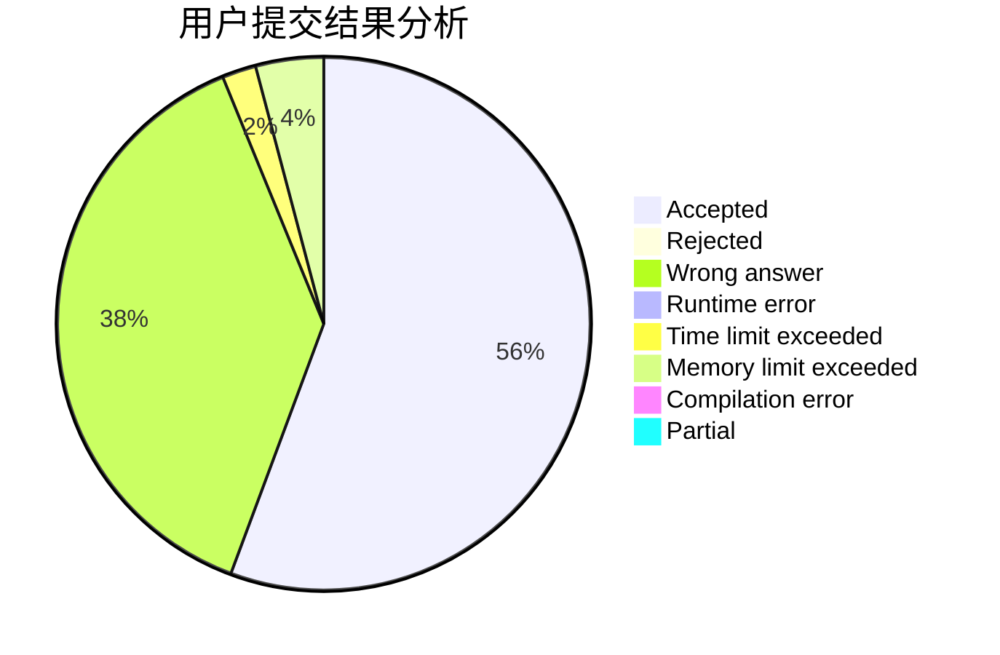
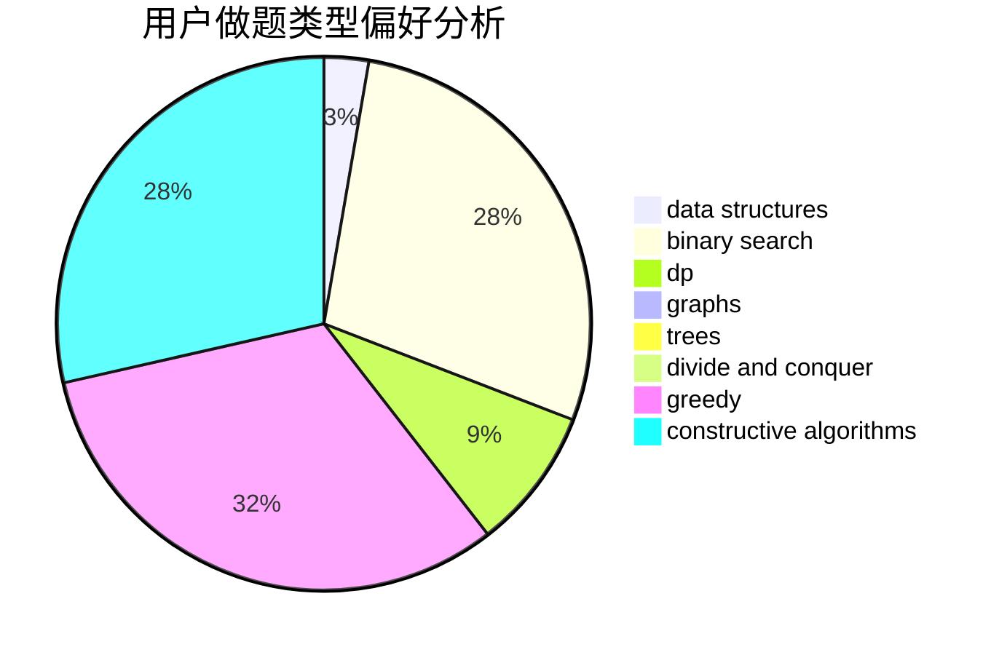
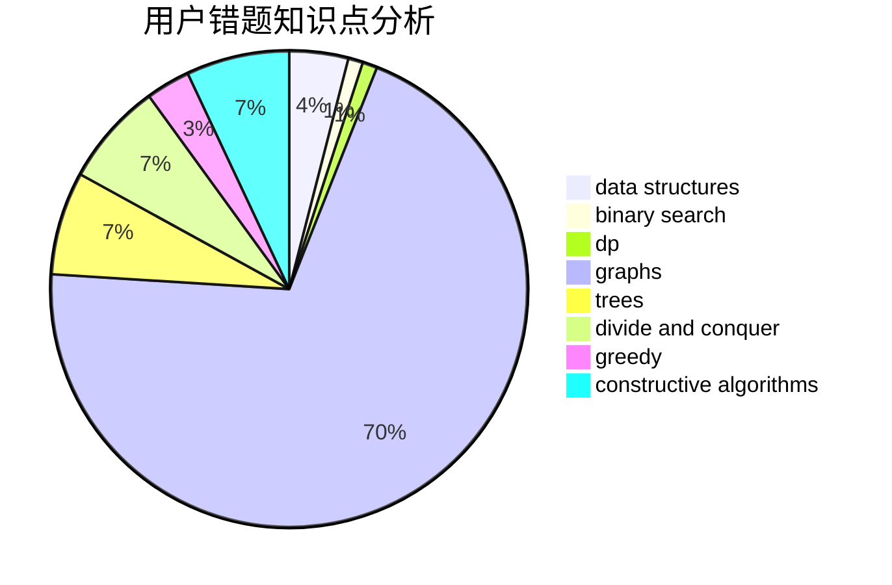

# sd197555

<!-- tabs:start -->

#### **用户提交结果分析**

#### **用户做题类型偏好分析**

#### **用户错题知识点分析**

<!-- tabs:end -->
# 推荐题目
[1157B](https://codeforces.com/contest/1157/problem/B)		greedy		  
[1028G](https://codeforces.com/contest/1028/problem/G)		dp,
                        interactive		  
[479E](https://codeforces.com/contest/479/problem/E)		combinatorics,
                        dp		  
[901C](https://codeforces.com/contest/901/problem/C)		binary search,
                        data structures,
                        dfs and similar,
                        dsu,
                        graphs,
                        two pointers		  
[218B](https://codeforces.com/contest/218/problem/B)		implementation		  
[12A](https://codeforces.com/contest/12/problem/A)		implementation		  
[845F](https://codeforces.com/contest/845/problem/F)		bitmasks,
                        dp		  
[987F](https://codeforces.com/contest/987/problem/F)		dsu,graphs,sortings,trees		  
[350B](https://codeforces.com/contest/350/problem/B)		graphs		  
[268B](https://codeforces.com/contest/268/problem/B)		implementation,
                        math		  
