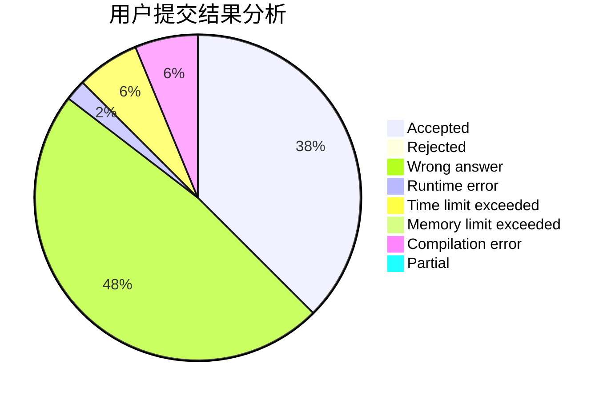
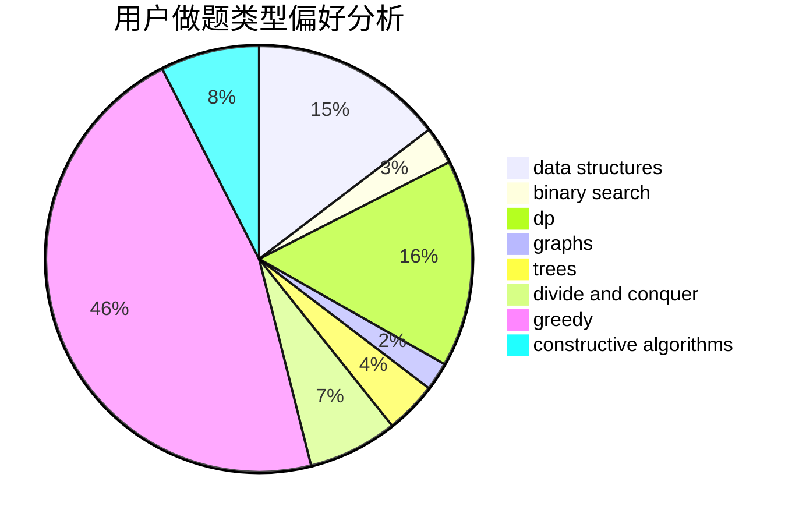

# sd542927172

<!-- tabs:start -->

#### **用户提交结果分析**

#### **用户做题类型偏好分析**

#### **用户错题知识点分析**

<!-- tabs:end -->
# 推荐题目
[814C](https://codeforces.com/contest/814/problem/C)		brute force,
                        dp,
                        strings,
                        two pointers		  
[417C](https://codeforces.com/contest/417/problem/C)		constructive algorithms,
                        graphs,
                        implementation		  
[269D](https://codeforces.com/contest/269/problem/D)		data structures,
                        dp,
                        graphs,
                        sortings		  
[898F](https://codeforces.com/contest/898/problem/F)		brute force,
                        hashing,
                        math		  
[543D](https://codeforces.com/contest/543/problem/D)		dp,
                        trees		  
[62E](https://codeforces.com/contest/62/problem/E)		dp,
                        flows		  
[1205C](https://codeforces.com/contest/1205/problem/C)		implementation,
                        interactive		  
[167C](https://codeforces.com/contest/167/problem/C)		games,
                        math		  
[1391E](https://codeforces.com/contest/1391/problem/E)		constructive algorithms,
                        dfs and similar,
                        graphs,
                        greedy,
                        trees		  
[1059A](https://codeforces.com/contest/1059/problem/A)		implementation		  
